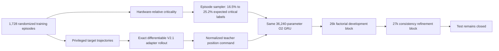

# Adapter-Aware Critical Curriculum V6/V6.1

## Research question

The V4/V5 study left three plausible performance barriers:

1. the training objective was not the selected controller's objective;
2. independently predicted bearing/rate heads could violate target dynamics;
3. the dataset was not concentrated on controller-critical states.

V6 addressed the first and third barriers while retaining V4's soft dynamic
consistency loss. V6.1 then tested whether stronger consistency pressure could
remove the remaining conflict. This was a development study; no fresh test
block was opened.

## Method



### Controller-critical episode curriculum

Criticality remains hardware-relative and training-only. Instead of weighting
individual labels, V6 weights whole causal episodes in a deterministic
replacement sampler. This preserves the geometry of each sequence loss and
raises expected critical-label exposure from 16.53% to 25.17%. Episodes that
are dominated by mechanically unreachable travel-limit labels are not
mistakenly prioritized.

### Actual downstream adapter objective

The privileged teacher replays the validation-selected V2.1 `preview_125`
position adapter against simulator truth. The differentiable student rollout
uses the GRU's predicted bearing, rate, and uncertainty with each episode's
configured:

- camera field of view;
- position travel limits;
- maximum rate and acceleration;
- command latency and rate time constant;
- position gain;
- V2.1 visibility-risk horizon boost;
- setpoint rate, acceleration, and jerk shaping.

The auxiliary loss is normalized position-command RMSE. Oracle trajectories
are available only to the loss. Deployment observations, architecture, and
inference inputs are unchanged.

An epsilon was added under the differentiable braking-speed square root to
remove its singular derivative at exactly zero setpoint error. A parity test
checks the differentiable rollout against the privileged truth replay, and a
full-data epoch confirmed finite gradients.

## Frozen V6 factorial

V6 used simulator seeds 26000--26007: 288 domain-randomized episodes spanning
six scenario families and all six rate/position collection behaviors. Each arm
trained for 20 epochs with GRU seed 17.

| Candidate vs V4 | Average bearing | Average rate | Critical 100 ms bearing | Critical 100 ms rate | Dynamic consistency | Adapter action | Critical adapter action |
|---|---:|---:|---:|---:|---:|---:|---:|
| Curriculum only | +3.65% | -3.79% | -3.51% | -2.89% | +4.31% | +2.32% | -5.19% |
| Adapter only, 0.10 | +1.72% | +0.10% | +1.90% | -1.11% | +11.78% | +0.68% | -1.12% |
| Combined, 0.10 | +3.25% | -3.61% | -2.77% | -3.83% | +116.48% | +0.55% | -7.16% |
| **Combined, 0.25** | **-1.15%** | **-2.41%** | **-5.21%** | **-3.55%** | **+99.83%** | **-3.61%** | **-9.21%** |

Negative changes are improvements. The combined 0.25 arm passed every state,
rate, critical-state, and adapter-action guard. It failed only dynamic
consistency, which approximately doubled. This is evidence that the actual
adapter loss is useful, but the independent forecast heads can satisfy it with
a dynamically incoherent trajectory.

## Fresh V6.1 consistency refinement

V6.1 was predeclared before generating seeds 27000--27007. It repeated the
combined 0.25/consistency-25 arm, raised the consistency coefficient to 50 and
100, and tested a gentler adapter-0.15/consistency-50 balance.

| Candidate vs fresh V4 | Average bearing | Average rate | 100 ms bearing | Critical 100 ms bearing | Critical 100 ms rate | Dynamic consistency | Adapter action | Critical adapter action | Failed guards |
|---|---:|---:|---:|---:|---:|---:|---:|---:|---|
| 0.25 / 25 | +1.67% | -2.14% | +1.45% | -7.15% | -3.52% | +95.18% | +1.04% | -5.61% | global action, consistency |
| 0.25 / 50 | +1.78% | -2.49% | +2.06% | -4.69% | -3.86% | +7.73% | +0.72% | -3.59% | global action, consistency, 100 ms bearing |
| 0.25 / 100 | +1.30% | -2.93% | +1.82% | -5.92% | -4.40% | +82.36% | -0.18% | -4.74% | global action, consistency |
| **0.15 / 50** | **+1.43%** | **-1.35%** | **+2.00%** | **-4.27%** | **-3.58%** | **-11.77%** | **-0.39%** | **-4.11%** | **global action only** |

The closest candidate, 0.15/50, improved consistency beyond V4 and passed all
state and critical-state guards. Its overall adapter-action improvement was
0.39%, below the frozen 1% requirement. It selected epoch 19, so longer
training is not the leading explanation. Coefficients 50 and 100 were not
monotonic because the learned optimizer settled on different prediction/action
tradeoffs; simply increasing a scalar penalty is not a robust solution.

## Verdict

Neither V6 nor V6.1 is promoted. V4 remains the selected predictor and the
fresh test remains sealed.

The experiment nevertheless resolves the original hypotheses:

- **Control-aware objective:** useful only when it models the real V2.1
  adapter; the best V6 arm improved both global and critical actions.
- **Dataset concentration:** useful for critical states, but overly
  concentrated sampling can trade global accuracy for edge-case performance.
- **Dynamic constraints:** a soft residual is insufficient because the action
  loss can exploit independent future-bearing heads.
- **Training duration:** not the primary barrier; the closest refinement peaked
  before the epoch limit.

## Next experiment

Use the hard `integrated_midpoint` target-state parameterization from V5 with
the actual V2.1 adapter loss and a milder critical-episode mixture. This makes
the adapter consume a trajectory whose bearing changes are generated by
endpoint and latent midpoint rates, preventing the action objective from
exploiting mutually inconsistent bearing heads. Screen that structural
factorial on a new development block before any multi-seed replication or
closed-loop test.

Reproducible entry points:

```bash
aol-develop-gimbal-adaptive-curriculum
aol-refine-gimbal-adaptive-curriculum
```

Development artifacts are written under `artifacts/` and intentionally remain
outside version control.
