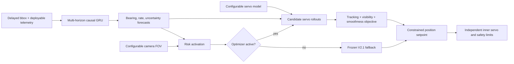

# Constrained Predictive Position V3 and V3.1

## Abstract

This experiment tests whether the accepted visibility-risk position controller
(V2.1) can be improved by explicitly rolling learned multi-horizon target
forecasts through configurable servo dynamics. V3 models command latency,
position-loop response, rate and acceleration limits, travel, polarity, and
queued commands while selecting a constrained absolute-position setpoint. It
reduced mechanically avoidable loss of view by 15.1% and command variation by
10.1% on untouched confirmation, but increased mean error by 0.140° and P95
error by 0.416°. The frozen safety gate rejected it. A corrective V3.1 that
required simultaneous rate-capacity and visibility risk failed development;
its confirmation block remained unopened. The accepted controller therefore
remains V2.1. The results localize the next bottleneck to the learned forecast
and its training objective rather than the absence of an actuator model.

## Hypothesis and controller

V2.1 chooses a target-state forecast from actuator-arrival timing and extends
its preview near the camera boundary. V3 instead evaluates candidate position
commands by simulating the configured inner servo over a short horizon. Every
hardware quantity comes from `ServoConfig` or `CameraConfig`; the controller
contains no fixed servo angle, speed, latency, travel, polarity, camera FOV, or
frame-rate assumption.



The optimizer uses the trained 0, 100, 200, and 300 ms forecast interface but
limits its control horizon to 100 ms. Longer learned-horizon forecasts produced
large tracking regressions during development, whereas a privileged oracle
with the same rollout controller achieved 4.35° mean error, 11.99° P95, and
zero loss of view in the aggressive diagnostic. This establishes that the
rollout mechanism can exploit accurate future state and that learned forecast
quality is the limiting input.

The deployed action remains an absolute position command. A configurable
setpoint shaper limits requested rate, acceleration, and jerk before the
independent plant applies its own physical constraints. If forecasts are
invalid, the controller holds the last command. If configured latency and
response prevent a command from affecting the plant within the optimization
horizon, or if the inner position gain is below the configured eligibility
threshold, V3 uses the frozen V2.1 fallback.

## Protocol

All comparisons use the same three independently trained disturbance-aware O2
GRUs. The previously inspected 80000–82007 worlds are forbidden.

| Stage | Worlds | Scenarios | Purpose |
|---|---:|---:|---|
| V3 development | 83000–83007 | five primary tracking families | select one of four predeclared activation/smoothness candidates |
| V3 confirmation | 84000–84007 | all six families | one evaluation of the frozen winner |
| V3.1 development | 85000–85007 | five primary tracking families | test joint-risk correction |
| V3.1 confirmation | 86000–86007 | all six families | reserved; open only if development passes |

The confirmation gate requires, versus V2.1:

- no aggregate mean- or P95-error regression;
- no total loss-of-view regression;
- at least 2% relative reduction in mechanically avoidable loss;
- at least 3% reduction in command variation;
- no additional unrecovered event; and
- bounded per-scenario P95 and avoidable-loss changes with no event regression.

Development permits only small normalized tracking tolerances for candidate
selection. Confirmation permits none. Thresholds are frozen in code before a
confirmation block is opened.

## V3 development and confirmation

All four V3 candidates passed development. The lexicographic selection rule
chose `capacity_smooth`, prioritizing unrecovered events, avoidable loss, P95,
mean error, and command variation in that order. On development it reduced
avoidable loss by 7.0% and variation by 10.8% relative to V2.1.

The untouched confirmation result was:

| Metric | V2.1 | V3 | Change |
|---|---:|---:|---:|
| Mean absolute error | 8.867° | 9.007° | +0.140° |
| P95 absolute error | 20.707° | 21.123° | +0.416° |
| Loss of view | 2.342% | 2.134% | −0.208 pp |
| Mechanically avoidable loss | 1.379% | 1.171% | −0.208 pp / −15.1% relative |
| Command variation/s | 1.135 | 1.020 | −10.1% |
| Actuator acceleration RMS, normalized | 0.612 | 0.591 | −0.021 |
| Unrecovered events | 4 | 4 | 0 |

V3 passed loss, smoothness, acceleration, and event checks. It failed the
predeclared mean- and P95-error checks and was rejected.

### Scenario localization

| Scenario | Mean change | P95 change | Loss change | Variation change |
|---|---:|---:|---:|---:|
| Nominal combined | +0.499° | +1.570° | +0.000 pp | −0.128/s |
| High latency | +0.135° | +0.138° | +0.000 pp | −0.057/s |
| Dropout and noise | +0.300° | +0.893° | +0.144 pp | −0.065/s |
| Slow servo | +0.000° | +0.000° | +0.000 pp | +0.000/s |
| Aggressive motion | **−0.223°** | **−0.521°** | **−1.199 pp** | **−0.324/s** |
| Travel-limit recovery | +0.041° | −0.000° | +0.000 pp | −0.024/s |

The optimizer was active on 19.7% of valid confirmation steps. It behaved as
intended in aggressive motion, but intervened too often when V2.1 was already
tracking adequately. This motivated V3.1 without changing or rerunning the
84000-series confirmation.

## V3.1 corrective development

V3.1 changed only the activation rule. V3 used the maximum of normalized
rate-capacity risk and uncertainty-inflated visibility risk—an “either risk”
gate. V3.1 predeclared minimum/product combinations that required evidence from
both signals. The controller configuration retains all individual onset/full
thresholds and the combination mode.

No V3.1 candidate passed 85000-series development:

| Candidate | Active steps | Avoidable-loss reduction | Variation reduction | Result |
|---|---:|---:|---:|---|
| `dual_risk_early` | 8.75% | −2.35% | 3.43% | reject |
| `dual_risk_balanced` | 5.10% | −0.74% | 1.70% | reject |
| `dual_risk_late` | 2.82% | −0.44% | 0.94% | reject |
| `dual_risk_product` | 11.39% | −2.94% | 3.72% | reject |

Negative “reduction” means avoidable loss increased. The joint gate suppressed
benign interventions but did not preserve V3's aggressive-motion benefit on
new development worlds. The evaluator therefore did not load or evaluate the
reserved 86000-series confirmation block.

## Interpretation

The experiments support four conclusions.

1. A configurable servo rollout is useful when supplied accurate future target
   state; privileged-oracle performance demonstrates this ceiling.
2. The current GRU is good enough to improve a heuristic/fixed predictor and
   support V2.1, but its future-state errors are not yet reliable enough for
   direct command optimization.
3. Activation heuristics alone cannot reliably separate beneficial from
   harmful learned-forecast interventions.
4. Loss reduction and smoothness are not sufficient promotion criteria;
   ordinary tracking accuracy must remain protected.

The next controller iteration should follow a predictor iteration. Recommended
work is to train with a causal control-aware objective that weights future
bearing errors by FOV proximity and achievable servo response, adds temporal
consistency for rate, and evaluates closed-loop regret against the privileged
oracle. Only after that predictor passes a fresh forecast and closed-loop gate
should constrained optimization be revisited on new development and
confirmation seeds.

## Reproduce and inspect

Run V3:

```bash
aol-evaluate-gimbal-predictive-position-v3 \
  --visibility-risk-results artifacts/gimbal_adaptive_position_v21.json \
  --contract configs/gimbal_performance_contract.json \
  --output artifacts/gimbal_predictive_position_v3.json
```

Run the corrective development protocol (confirmation remains automatic and
sealed unless development passes):

```bash
aol-evaluate-gimbal-predictive-position-v31 \
  --v3-results artifacts/gimbal_predictive_position_v3.json \
  --visibility-risk-results artifacts/gimbal_adaptive_position_v21.json \
  --contract configs/gimbal_performance_contract.json \
  --output artifacts/gimbal_predictive_position_v31.json
```

Open the combined audit, scenario deltas, and representative V2.1/V3 action
trace with:

```bash
scripts/open_gimbal_predictive_position_dashboard.sh
```

Create a portable recording with:

```bash
aol-visualize-gimbal --demo predictive-position \
  --output artifacts/gimbal_predictive_position_dashboard.rrd
```
