# Control-Aware Predictor V4/V5 Experiment

## Question

The V3/V3.1 controller study identified the learned target-state predictor as
the main performance bottleneck. This experiment tested three concrete
explanations:

1. the supervised objective did not reflect control consequences;
2. the four prediction horizons were dynamically independent;
3. the training distribution was modest and did not emphasize
   controller-critical states.

The goal was not to accept a more elaborate model by default. Every candidate
had to improve a frozen reference under disjoint development blocks, replicate
across initializations, pass one untouched open-loop test, and then survive a
fresh closed-loop comparison.

## Protocol

```mermaid
flowchart LR
    A[432-episode legacy data] --> B[1,728-episode randomized train block]
    B --> C[Critical-state audit and loss ablations]
    C --> D[Cross-horizon consistency loss]
    D --> E[Seeds 17, 29, 43 replication]
    E --> F[Untouched 31k open-loop test]
    F --> G[Oracle-action loss ablations]
    G --> H[Hard trapezoidal and midpoint heads]
    H --> I[Fresh 87k closed-loop worlds]
```

The expanded training set uses 48 simulator seeds, six scenario families, six
rate/position collection policies, three deployable observation profiles, and
domain-randomized camera, servo, motion, and timing parameters. It contains
1,728 episodes and 1,634,658 valid labels, versus 432 episodes in the previous
training block. Hardware values are read from each serialized episode; the
loss contains no fixed camera FOV, travel, rate, acceleration, latency, or
servo-response constants.

Control criticality is computed from privileged labels only during training.
It combines normalized visibility margin, target-rate capacity, acceleration
demand, reversal, detector gap, joint visibility/capacity risk, and mechanical
reachability. In the expanded train block, 16.53% of labels are critical and
receive 39.31% of effective weight under full weighting.

The frozen acceptance sequence was:

- screen objectives on development data;
- replicate the winner against a seed-matched expanded-data baseline for GRU
  seeds 17, 29, and 43;
- open test seeds 31000--31007 once;
- test the frozen predictor/controller combinations on randomized worlds
  87000--87007.

## Implemented objectives

### Hardware-relative critical weighting

The criticality tensor weights labels near field-of-view boundaries, actuator
capacity, reversals, detector gaps, and coupled visibility/capacity events.
Full weighting improved seed-17 critical 100 ms bearing RMSE by 16.6%, but
increased dynamic inconsistency by 31.4% and standard rate RMSE by 2.3%.
Strengths 0.20, 0.35, and 0.50 were evaluated on a separate development block;
none passed. Critical weighting is therefore implemented and auditable but is
not enabled in the selected model.

### Dynamic consistency

The selected V4 loss penalizes disagreement between adjacent bearing heads and
the trapezoidal integral of their predicted angular rates:

\[
r_k = \operatorname{wrap}\left(
  \hat\theta_{k+1}-\hat\theta_k
  -\frac{\Delta t_k}{2}(\hat\omega_k+\hat\omega_{k+1})
\right).
\]

This adds no deployable inputs or model parameters. The selected coefficient is
25, chosen before multi-seed replication.

### Oracle-action supervision

The dataset already contains privileged normalized rate and position actions.
V4.2 converts the current predicted state into both commands through each
episode's configured actuator:

\[
u_\omega=\operatorname{clip}\left(
\frac{\hat\omega+k_p\operatorname{wrap}(\hat\theta-q)}{\omega_{\max}},
-1,1\right),
\]

with an analogous asymmetric travel-normalized position command. Rate-only,
position-only, balanced dual-mode, and position-prioritized losses all improved
some action metrics on the first development block, but none preserved dynamic
consistency and ordinary state accuracy. A lower-weight/stronger-consistency
refinement also failed on new seeds. The generic oracle-action surrogate is
therefore a documented negative result, not part of the selected model.

### Hard dynamic parameterizations

Two architecture-level constraints were tested:

- trapezoidal integration of predicted endpoint rates;
- Simpson integration using latent interval-midpoint rates, allowing
  acceleration/curvature without independent future-bearing heads.

Both make their chosen integration equation exact by construction. The
trapezoidal model reduced bearing error but raised rate RMSE by 3--5%. The
midpoint model avoided most of that rate penalty, but its closest candidate
still improved rate-action RMSE by only 0.32% against a required 1% and exceeded
the standard-rate guard by 0.02 percentage points. These parameterizations
remain available for future work but were rejected by the frozen gates.

## Replication result

The expanded-data baseline and V4 use the same 36,240-parameter independent
GRU, data, optimizer, and training seeds. Only the dynamic-consistency term
differs.

| Validation metric, mean over 3 GRU seeds | Expanded baseline | V4 | Relative change |
|---|---:|---:|---:|
| Standard bearing RMSE | 13.99 deg | 13.79 deg | -1.40% |
| Standard rate RMSE | 25.59 deg/s | 25.59 deg/s | +0.02% |
| 100 ms bearing RMSE | 13.59 deg | 13.27 deg | -2.32% |
| Critical 100 ms bearing RMSE | 11.58 deg | 10.83 deg | -6.49% |
| Critical 100 ms rate RMSE | 34.23 deg/s | 34.28 deg/s | +0.12% |
| Dynamic consistency RMSE | 2.16 deg | 0.96 deg | -55.32% |

All three seed-matched gates passed. V4 then advanced to the sealed open-loop
test.

## Fresh open-loop test

The untouched test contains 288 episodes from seeds 31000--31007. Critical
labels comprise 17.34% of valid labels.

| Test metric, mean over 3 GRU seeds | Expanded baseline | V4 | Relative change |
|---|---:|---:|---:|
| Standard bearing RMSE | 16.02 deg | 16.09 deg | +0.46% |
| Standard rate RMSE | 24.32 deg/s | 24.45 deg/s | +0.56% |
| 100 ms bearing RMSE | 15.77 deg | 15.78 deg | +0.05% |
| Critical 100 ms bearing RMSE | 9.46 deg | 8.94 deg | **-5.45%** |
| Critical 100 ms rate RMSE | 30.42 deg/s | 30.80 deg/s | +1.24% |
| Dynamic consistency RMSE | 2.07 deg | 0.87 deg | **-57.97%** |

All predeclared checks passed. The result supports a narrow claim: the soft
constraint substantially improves high-consequence bearing forecasts and
cross-horizon coherence, with small average state-error regressions inside the
guard. It does not support a blanket claim that every open-loop metric is
better.

## Fresh closed-loop result

The controller test uses worlds 87000--87007, all six scenario families, the
frozen V2.1 position adapter, and a fixed 100 ms rate adapter. The table reports
the five primary tracking scenarios and averages over three GRU seeds.

| Controller | Mean error | P95 error | Loss of view | Avoidable loss | Command variation/s |
|---|---:|---:|---:|---:|---:|
| Analytical position | 10.42 deg | 25.90 deg | 4.99% | 3.36% | 1.177 |
| Legacy O2 + V2.1 position | **8.34 deg** | **21.05 deg** | 2.94% | 1.30% | **1.127** |
| Expanded baseline + V2.1 position | 8.42 deg | 21.49 deg | **2.73%** | **1.09%** | 1.395 |
| V4 + V2.1 position | 8.37 deg | 21.39 deg | 2.77% | 1.13% | 1.317 |
| Expanded baseline, 100 ms rate | 10.12 deg | 24.65 deg | 4.01% | 2.37% | 4.582 |
| V4, 100 ms rate | **9.69 deg** | **23.72 deg** | **3.31%** | **1.67%** | **4.423** |

Relative to the expanded baseline, V4 position improves mean error by 0.60%,
P95 by 0.45%, forecast error by 6.0%, and command variation by 5.6%. Loss of
view increases by 0.038 percentage points. The aggregate metrics satisfy every
numeric guard, but only one of three GRU initializations improves mean position
error; the frozen requirement is two. Position therefore **fails promotion due
to initialization variance**.

V4 rate passes: mean error improves 4.25%, P95 3.76%, avoidable loss by 0.69
percentage points, forecast error 6.62%, command variation 3.48%, and actuator
acceleration 0.91%. Two of three initializations improve mean error.

No controller meets the provisional absolute performance contract, so neither
the V4 rate pass nor its position aggregate gains constitute deployment
qualification.

## Verdict and next experiment

1. **Training duration is not the main barrier.** Earlier 50-epoch models often
   reached their best validation epoch before training ended; the new studies
   also select epochs 16--20 with validation tradeoffs rather than uniform
   underfitting.
2. **More randomized data helps substantially.** The expanded-data baseline is
   much stronger than the legacy predictor in open-loop development metrics.
3. **Soft dynamic consistency is useful and replicable.** It is the selected V4
   mechanism and produces a robust rate-controller gain.
4. **Naive critical weighting and oracle-action imitation are not sufficient.**
   They improve their local objectives but create harmful gradient tradeoffs.
5. **The immediate barrier is seed variance and controller mismatch.** The
   generic oracle command is not the frozen V2.1 adapter's action. The next
   study should concentrate minibatches at controller-critical episodes and
   train against a differentiable approximation of the actual downstream
   adapter/plant, then use either a validation-selected seed or a small causal
   ensemble before opening another test block.

Artifacts are intentionally ignored by Git but are reproducible through the
`aol-develop-gimbal-*`, `aol-replicate-gimbal-control-aware-predictor`,
`aol-test-gimbal-control-aware-predictor`, and
`aol-evaluate-gimbal-control-aware-closed-loop` commands.
