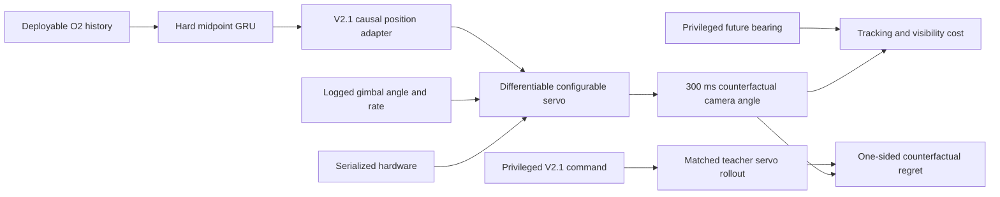

# Counterfactual Servo-Plant Objective V8--V8.7

## Research question

V7 showed that hard midpoint-integrated target dynamics improve ordinary
bearing prediction and global adapter action, but privileged command imitation
does not robustly improve controller-critical behavior. The missing mechanism
was counterfactual: a student's command changes the future actuator and image
state, while command imitation only compares actions on a logged trajectory.

V8 asked whether a differentiable, hardware-configured servo rollout can turn
the hard-midpoint GRU into a smoother and more effective position controller
without sacrificing its state-prediction safety envelope.

## Plant and causal rollout

For each logged pre-action state, the V2.1 adapter produces one causal absolute
position setpoint. That setpoint is repeated under zero-order hold and rolled
through the serialized episode plant. The rollout includes:

- asymmetric travel and body-forward zero;
- command polarity and position quantization;
- command latency;
- position-loop gain and tolerance;
- rate lag, rate limit, and acceleration limit;
- control, camera-frame, and numerical-integration event boundaries; and
- mechanical travel saturation.

The initial applied setpoint holds the measured gimbal angle until the new
command arrives. No future observation or target state is exposed to the
deployable model. Privileged future bearing and the privileged V2.1 response
are used only by the training loss and development metrics.

The exact rollout uses each episode's serialized integration period. A two-step
position-control parity test, including non-grid-aligned latency, lag,
tolerance, quantization, and event splitting, matches the existing simulator's
angle and rate to `2e-12`. Training uses an explicitly declared 10 ms numerical
step for tractability; every reported outcome is recomputed with the exact
serialized 1 ms step.



## Why the objective changed during development

The development block remained fixed and the fresh test stayed closed. Each
revision tested a specific failure observed in the preceding result.

| Revision | Change | Finding |
|---|---|---|
| V8 | Absolute tracking at 100 ms | Too early for randomized actuator latency/lag; privileged ceiling only 0.13% better |
| V8.1 | Move rollout to 300 ms | A 4.40% privileged ceiling exists, but absolute scene error dominates the gradient |
| V8.2 | Match privileged plant response | Heteroscedastic NLL selected uncertainty changes while global control means regressed |
| V8.3 | Deterministic state mean + response | Response, smoothness, and saturation improve, but matching the teacher where the student is already better does not improve global tracking |
| V8.4 | One-sided counterfactual regret | True tracking improves, but excessive regret weight harms state, adapter, smoothness, and saturation safety |
| V8.5 | Rebalance regret/state/smoothness/saturation | All guards pass except critical 100 ms bearing prediction |
| V8.6 | Add critical episode and label weighting | Critical bearing remains obscured because shared state MSE is dominated by rate error |
| **V8.7** | Separate bearing-mean and rate-mean weights | **Moderate-regret arm passes every development guard** |

The final plant regret is

\[
L_{\mathrm{regret}} =
\mathbb{E}\left[
\max\left(0,
e_{\mathrm{student}}^2-e_{\mathrm{privileged}}^2
\right)
\right],
\]

where both image errors result from the same initial gimbal state, target truth,
hardware, horizon, and servo simulation. The loss is zero wherever the student
already beats the privileged response. This concentrates gradients on states
where a different command has demonstrated actuator-level value.

The selected V8.7 scalarization uses:

- hard `integrated_midpoint` dynamics;
- 300 ms local plant rollout;
- regret weight 7.5;
- bearing-mean weight 6 and rate-mean weight 2;
- smoothness weight 10 and saturation weight 0.05;
- critical whole-episode sampling and per-label critical weights;
- six fine-tuning epochs at learning rate `1e-4`; and
- the original 36,240-parameter deployment architecture.

## V8.7 development result

All values are from the untouched 28000-series development block. The
reference is the seed-17 V7 hard-midpoint state-only checkpoint. Negative
relative change is an improvement.

| Metric | Reference | Selected V8.7 | Relative change |
|---|---:|---:|---:|
| Average bearing RMSE | 13.442 deg | 13.330 deg | **-0.83%** |
| Average rate RMSE | 26.343 deg/s | 26.850 deg/s | +1.92% |
| 100 ms bearing RMSE | 12.930 deg | 12.830 deg | **-0.78%** |
| Critical 100 ms bearing RMSE | 10.416 deg | 10.382 deg | **-0.33%** |
| Critical 100 ms rate RMSE | 36.982 deg/s | 36.172 deg/s | **-2.19%** |
| V2.1 adapter-action RMSE | 0.1981 | 0.1949 | **-1.63%** |
| Critical adapter-action RMSE | 0.3092 | 0.2988 | **-3.36%** |
| Exact 300 ms tracking RMSE | 0.6891 | 0.6848 | **-0.63%** |
| Critical exact 300 ms tracking RMSE | 0.6666 | 0.6615 | **-0.77%** |
| Plant-response RMSE | 0.08215 | 0.08029 | **-2.27%** |
| Critical plant-response RMSE | 0.08777 | 0.08511 | **-3.02%** |
| Counterfactual-regret RMSE | 0.2076 | 0.1965 | **-5.34%** |
| Critical regret RMSE | 0.1912 | 0.1758 | **-8.09%** |
| Visibility-violation RMSE | 0.3285 | 0.3271 | **-0.43%** |
| Critical visibility violation | 0.2445 | 0.2430 | **-0.64%** |
| Command-difference RMSE | 0.04539 | 0.04262 | **-6.10%** |
| Plant-saturation RMSE | 0.9846 | 0.9266 | **-5.89%** |

The selected model passes every frozen development check. The average-rate
regression is 1.92%, only 0.08 percentage points inside the 2% ceiling, so the
result is promising but fragile. The conservative-regret arm misses that same
guard at +2.018%, confirming that replication is necessary rather than
optional.

## Interpretation

V8.7 provides development evidence for the three barrier hypotheses that
motivated this work:

1. **The objective needed control consequences.** Plant regret produces a
   measurable exact tracking gain where command imitation did not.
2. **The prediction heads needed dynamic structure.** The deployable model
   retains hard midpoint integration; the control loss cannot exploit
   inconsistent bearing heads.
3. **The data needed controller-critical concentration.** Whole-episode
   sampling alone was insufficient. Per-label critical weighting and
   plant-derived regret concentration were both needed.

It also improves the earlier smoothness concern: command-difference RMSE falls
6.10% rather than increasing. Lower visibility violation and saturation show
that this smoothness was not purchased by simply reducing command authority.

## Limitations and next gate

This is not yet a promoted controller.

- It is one fine-tuning seed initialized from one V7 checkpoint.
- The rollout holds one causal command; it is not a fully differentiable
  recurrent image-feedback simulation.
- The average-rate safety margin is narrow.
- All selection used development data. No fresh test, deployment run, or
  sim-to-real claim was opened.

The justified next step is seed-matched V8.7 replication from the seed-17,
seed-29, and seed-43 hard-midpoint checkpoints. Replication must retain the
state, adapter, exact tracking, visibility, smoothness, saturation, and
per-seed safety gates. Only a replicated pass should proceed to closed-loop
scenario evaluation or a fresh test block.

Reproduce the development screen with:

```bash
aol-develop-gimbal-counterfactual-plant
```

Generated datasets, result JSON, and checkpoints remain under ignored
`artifacts/` paths.
