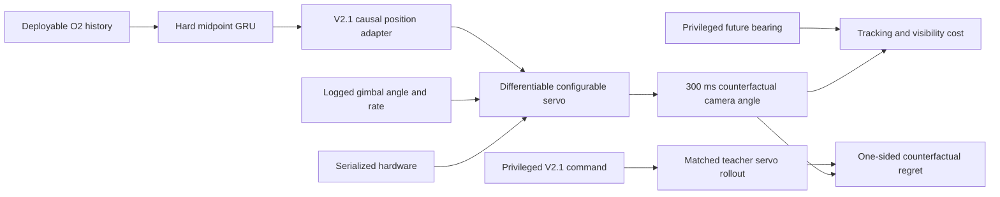
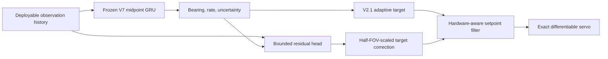

# Counterfactual Servo-Plant Objective V8--V8.7

## Research question

V7 showed that hard midpoint-integrated target dynamics improve ordinary
bearing prediction and global adapter action, but privileged command imitation
does not robustly improve controller-critical behavior. The missing mechanism
was counterfactual: a student's command changes the future actuator and image
state, while command imitation only compares actions on a logged trajectory.

V8 asked whether a differentiable, hardware-configured servo rollout can turn
the hard-midpoint GRU into a smoother and more effective position controller
without sacrificing its state-prediction safety envelope.

## Plant and causal rollout

For each logged pre-action state, the V2.1 adapter produces one causal absolute
position setpoint. That setpoint is repeated under zero-order hold and rolled
through the serialized episode plant. The rollout includes:

- asymmetric travel and body-forward zero;
- command polarity and position quantization;
- command latency;
- position-loop gain and tolerance;
- rate lag, rate limit, and acceleration limit;
- control, camera-frame, and numerical-integration event boundaries; and
- mechanical travel saturation.

The initial applied setpoint holds the measured gimbal angle until the new
command arrives. No future observation or target state is exposed to the
deployable model. Privileged future bearing and the privileged V2.1 response
are used only by the training loss and development metrics.

The exact rollout uses each episode's serialized integration period. A two-step
position-control parity test, including non-grid-aligned latency, lag,
tolerance, quantization, and event splitting, matches the existing simulator's
angle and rate to `2e-12`. Training uses an explicitly declared 10 ms numerical
step for tractability; every reported outcome is recomputed with the exact
serialized 1 ms step.



## Why the objective changed during development

The development block remained fixed and the fresh test stayed closed. Each
revision tested a specific failure observed in the preceding result.

| Revision | Change | Finding |
|---|---|---|
| V8 | Absolute tracking at 100 ms | Too early for randomized actuator latency/lag; privileged ceiling only 0.13% better |
| V8.1 | Move rollout to 300 ms | A 4.40% privileged ceiling exists, but absolute scene error dominates the gradient |
| V8.2 | Match privileged plant response | Heteroscedastic NLL selected uncertainty changes while global control means regressed |
| V8.3 | Deterministic state mean + response | Response, smoothness, and saturation improve, but matching the teacher where the student is already better does not improve global tracking |
| V8.4 | One-sided counterfactual regret | True tracking improves, but excessive regret weight harms state, adapter, smoothness, and saturation safety |
| V8.5 | Rebalance regret/state/smoothness/saturation | All guards pass except critical 100 ms bearing prediction |
| V8.6 | Add critical episode and label weighting | Critical bearing remains obscured because shared state MSE is dominated by rate error |
| **V8.7** | Separate bearing-mean and rate-mean weights | **Moderate-regret arm passes every development guard** |

The final plant regret is

\[
L_{\mathrm{regret}} =
\mathbb{E}\left[
\max\left(0,
e_{\mathrm{student}}^2-e_{\mathrm{privileged}}^2
\right)
\right],
\]

where both image errors result from the same initial gimbal state, target truth,
hardware, horizon, and servo simulation. The loss is zero wherever the student
already beats the privileged response. This concentrates gradients on states
where a different command has demonstrated actuator-level value.

The selected V8.7 scalarization uses:

- hard `integrated_midpoint` dynamics;
- 300 ms local plant rollout;
- regret weight 7.5;
- bearing-mean weight 6 and rate-mean weight 2;
- smoothness weight 10 and saturation weight 0.05;
- critical whole-episode sampling and per-label critical weights;
- six fine-tuning epochs at learning rate `1e-4`; and
- the original 36,240-parameter deployment architecture.

## V8.7 development result

All values are from the untouched 28000-series development block. The
reference is the seed-17 V7 hard-midpoint state-only checkpoint. Negative
relative change is an improvement.

| Metric | Reference | Selected V8.7 | Relative change |
|---|---:|---:|---:|
| Average bearing RMSE | 13.442 deg | 13.330 deg | **-0.83%** |
| Average rate RMSE | 26.343 deg/s | 26.850 deg/s | +1.92% |
| 100 ms bearing RMSE | 12.930 deg | 12.830 deg | **-0.78%** |
| Critical 100 ms bearing RMSE | 10.416 deg | 10.382 deg | **-0.33%** |
| Critical 100 ms rate RMSE | 36.982 deg/s | 36.172 deg/s | **-2.19%** |
| V2.1 adapter-action RMSE | 0.1981 | 0.1949 | **-1.63%** |
| Critical adapter-action RMSE | 0.3092 | 0.2988 | **-3.36%** |
| Exact 300 ms tracking RMSE | 0.6891 | 0.6848 | **-0.63%** |
| Critical exact 300 ms tracking RMSE | 0.6666 | 0.6615 | **-0.77%** |
| Plant-response RMSE | 0.08215 | 0.08029 | **-2.27%** |
| Critical plant-response RMSE | 0.08777 | 0.08511 | **-3.02%** |
| Counterfactual-regret RMSE | 0.2076 | 0.1965 | **-5.34%** |
| Critical regret RMSE | 0.1912 | 0.1758 | **-8.09%** |
| Visibility-violation RMSE | 0.3285 | 0.3271 | **-0.43%** |
| Critical visibility violation | 0.2445 | 0.2430 | **-0.64%** |
| Command-difference RMSE | 0.04539 | 0.04262 | **-6.10%** |
| Plant-saturation RMSE | 0.9846 | 0.9266 | **-5.89%** |

The selected model passes every frozen development check. The average-rate
regression is 1.92%, only 0.08 percentage points inside the 2% ceiling, so the
result is promising but fragile. The conservative-regret arm misses that same
guard at +2.018%, confirming that replication is necessary rather than
optional.

## Seed-matched replication

The selected V8.7 objective was then frozen and applied independently to the
seed-17, seed-29, and seed-43 V7 hard-midpoint checkpoints. Each fine-tuned
model was compared with its own starting checkpoint. No hyperparameter was
selected from the replication result, and the fresh test remained closed.

| Three-seed mean | Reference | V8.7 | Relative change |
|---|---:|---:|---:|
| Average bearing RMSE | 13.310 deg | 13.385 deg | +0.57% |
| Average rate RMSE | 26.295 deg/s | 26.609 deg/s | +1.19% |
| 100 ms bearing RMSE | 12.833 deg | 12.919 deg | +0.67% |
| Critical 100 ms bearing RMSE | 10.471 deg | 10.312 deg | **-1.52%** |
| Critical 100 ms rate RMSE | 36.678 deg/s | 35.864 deg/s | **-2.22%** |
| Adapter-action RMSE | 0.1956 | 0.1966 | +0.47% |
| Critical adapter-action RMSE | 0.3132 | 0.3007 | **-4.00%** |
| Exact 300 ms tracking RMSE | 0.6888 | 0.6857 | **-0.44%** |
| Critical exact tracking RMSE | 0.6666 | 0.6611 | **-0.82%** |
| Counterfactual-regret RMSE | 0.2059 | 0.2000 | **-2.85%** |
| Critical regret RMSE | 0.1912 | 0.1745 | **-8.76%** |
| Visibility-violation RMSE | 0.3278 | 0.3287 | +0.28% |
| Command-difference RMSE | 0.04344 | 0.04207 | **-3.15%** |
| Plant-saturation RMSE | 0.9576 | 0.9306 | **-2.82%** |

The mean gate fails: global exact tracking improves 0.44%, below the frozen
0.5% requirement, and visibility regresses 0.28%. Two seeds pass individually:

| Seed | Global tracking | Critical tracking | Smoothness | Saturation | Development gate |
|---:|---:|---:|---:|---:|---|
| 17 | -0.63% | -0.77% | -6.10% | -5.89% | Pass |
| 29 | **+0.13%** | -0.61% | -1.55% | -1.56% | **Fail** |
| 43 | -0.82% | -1.08% | -1.62% | -0.87% | Pass |

Seed 29 also regresses average bearing by 3.27%, 100 ms bearing by 3.48%,
adapter action by 5.42%, regret by 3.92%, and visibility by 1.53%. It fails the
per-seed state, adapter, and global-tracking safety checks. Seed 43, which was
the problematic V7 initialization, now passes every V8.7 guard. The instability
has therefore moved rather than disappeared.

## Seed-29 trajectory diagnostic

The failed initialization was subsequently diagnosed without changing the
frozen V8.7 loss or opening the fresh test. Every epoch was retained and
re-evaluated with the exact serialized plant. A preliminary rate screen at
`1e-4` and `5e-5`, using optimization seed 29, produced no passing epoch. The
global regression was already present after epoch one, ruling out a late
fine-tuning overshoot.

The seed used by the replacement sampler and minibatch order was then
decoupled from the seed-29 base checkpoint. Optimization seeds 17 and 43 were
each run for six epochs at `1e-4`. Again, none of the twelve checkpoints passed.
The best global compromise was optimization-seed 17, epoch 3:

| Metric | Relative change from seed-29 V7 |
|---|---:|
| Average bearing RMSE | +1.21% |
| 100 ms bearing RMSE | +1.04% |
| Average rate RMSE | +1.13% |
| Adapter-action RMSE | +2.76% |
| Exact 300 ms tracking RMSE | **-0.25%** |
| Critical exact tracking RMSE | **-0.54%** |
| Counterfactual-regret RMSE | **-1.16%** |
| Critical regret RMSE | **-5.92%** |
| Visibility-violation RMSE | +0.40% |
| Command-difference RMSE | +0.13% |
| Plant-saturation RMSE | +0.04% |

Across optimization seeds and epochs, critical tracking usually improves while
ordinary bearing, adapter action, global visibility, and global regret regress.
This is a repeatable gradient conflict between concentrating on
controller-critical examples and retaining the starting model's ordinary-state
behavior. It is not explained by training duration, learning rate, epoch
selection, or data-order randomness.

## V8.8 conservative-update experiments

V8.8 added a training-only functional trust region. The V7 predictor remains
frozen as a reference, and the fine-tuned model is penalized for changing its
bearing/rate means on valid non-critical labels. Critical labels retain the
full V8.7 counterfactual objective. The deployed architecture and observation
schema are unchanged. Anchor weights 6 and 2 were predeclared to match V8.7's
bearing/rate mean-error weights; 83.47% of valid training labels are anchored.

The plain anchor produced no passing seed-29 checkpoint, but epoch 4 passed
every per-seed safety check and substantially reduced the V8.7 failure:

| Metric | Unanchored V8.7 epoch 4 | Anchored V8.8 epoch 4 |
|---|---:|---:|
| Average bearing RMSE | +3.27% | +0.43% |
| 100 ms bearing RMSE | +3.48% | +0.55% |
| Adapter-action RMSE | +5.42% | +0.49% |
| Global exact tracking RMSE | +0.13% | **-0.34%** |
| Critical exact tracking RMSE | -0.61% | **-0.53%** |
| Global regret RMSE | +3.92% | **-2.77%** |
| Critical regret RMSE | -8.09% | **-6.01%** |
| Visibility violation | +1.53% | +0.11% |
| Command difference | -1.55% | **-0.18%** |

It missed only the stricter 0.5% global-tracking requirement and global
visibility non-regression. Adding weak direct tracking and visibility terms
(weight 1 each versus regret weight 7.5) did not fix those misses and worsened
state, action, visibility, and smoothness. This rules out that simple residual
scalarization.

The next ablation projected the V8.7 control gradient away from the anchor
gradient whenever their dot product was negative. Gradient conflict occurred
in 49--72% of minibatches, directly confirming the interference hypothesis.
Projection improved the Pareto frontier but still produced no passing epoch:

| Metric | Projected anchor, epoch 4 |
|---|---:|
| Average bearing RMSE | **-0.59%** |
| 100 ms bearing RMSE | **-0.58%** |
| Average rate RMSE | **-1.63%** |
| Adapter-action RMSE | **-0.71%** |
| Critical adapter-action RMSE | **-3.25%** |
| Global exact tracking RMSE | **-0.46%** |
| Critical exact tracking RMSE | **-0.45%** |
| Global regret RMSE | **-4.44%** |
| Critical regret RMSE | **-4.98%** |
| Visibility violation | **-0.30%** |
| Command difference | +0.99% |
| Plant saturation | **-0.44%** |

This checkpoint misses both tracking thresholds by less than 0.05 percentage
points and regresses smoothness. The result is scientifically useful but does
not pass the frozen gate; thresholds were not relaxed after observing it.

## V8.9 frozen-state residual policy

V8.9 removes the shared-representation failure mode. The complete 36,240
parameter V7 state predictor is frozen, and a zero-initialized 1,185-parameter
causal MLP learns only a bounded correction to the adaptive controller's
position target. The correction is expressed as a configurable fraction of
each episode's serialized camera half-FOV, then passes through the existing
hardware-aware target clamp, rate, acceleration, and jerk limits. Its default
absolute bound is 0.25 half-FOV. At initialization, state and action behavior
exactly match V7; state outputs remain identical throughout training.



Three predeclared variants were evaluated on the seed-29 development block:

| Variant | Best global tracking | Best critical tracking | State change | Main failure |
|---|---:|---:|---:|---|
| V8.9 regret residual | **-0.37%** | **-0.32%** | exactly 0 | action +3.4%, smoothness +6.9% near the useful epoch |
| V8.9.1 action + stronger smoothness | **-0.24%** | **-0.32%** | exactly 0 | command shaping improves, tracking falls |
| V8.9.2 direct tracking, balanced labels | **-0.47%** | **-0.24%** | exactly 0 | action +6.1%, smoothness +16.2% near best tracking |

The residual reaches 0.243--0.247 of its 0.25 half-FOV bound in the later
epochs of all variants. V8.9 therefore validates the architectural separation
of estimation and control but does not pass the controller gate. The direct
variant nearly crosses global tracking while losing critical tracking and
smoothness, showing that a single held correction cannot express the required
time sequence.

## Interpretation

V8.7 provides development evidence for the three barrier hypotheses that
motivated this work:

1. **The objective needed control consequences.** Plant regret produces a
   measurable exact tracking gain where command imitation did not.
2. **The prediction heads needed dynamic structure.** The deployable model
   retains hard midpoint integration; the control loss cannot exploit
   inconsistent bearing heads.
3. **The data needed controller-critical concentration.** Whole-episode
   sampling alone was insufficient. Per-label critical weighting and
   plant-derived regret concentration were both needed.

It also improves the earlier smoothness concern: command-difference RMSE falls
6.10% rather than increasing. Lower visibility violation and saturation show
that this smoothness was not purchased by simply reducing command authority.

## Limitations and next gate

This is not a promoted controller. The three-seed replication failed.

- The rollout holds one causal command; it is not a fully differentiable
  recurrent image-feedback simulation.
- Two initializations improve broadly, but seed 29 shifts performance from the
  ordinary distribution into controller-critical states.
- All selection used development data. No fresh test, deployment run, or
  sim-to-real claim was opened.

The seed-29 diagnostic, functional anchor, residual scalarization,
conflict-projected update, and frozen-state residual policy are complete.
Optimization noise and shared state interference are no longer credible
explanations for the remaining limit. The present rollout holds one causal
command for 300 ms; it cannot teach the residual head how a smooth sequence of
future commands should react to target and gimbal evolution. The justified
next step is a multi-command differentiable rollout with recurrent policy
state and counterfactual observations, or an equivalent constrained
closed-loop policy-optimization protocol. It must retain serialized hardware,
state-output invariance, smoothness/visibility guards, and independent-seed
evaluation. No V8.x result qualifies for promotion or a fresh test block.

Reproduce the development screen with:

```bash
aol-develop-gimbal-counterfactual-plant
aol-replicate-gimbal-counterfactual-plant
aol-diagnose-gimbal-counterfactual-seed
aol-develop-gimbal-counterfactual-reference-anchor
aol-develop-gimbal-counterfactual-residual-policy
```

Generated datasets, result JSON, and checkpoints remain under ignored
`artifacts/` paths.
