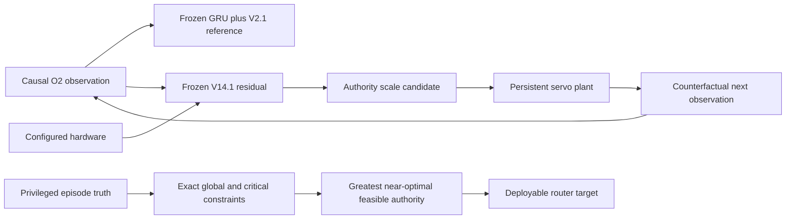

# State-Consistent Authority Distillation V16

## Question

V15 localized the last promotion failure of the V14.1 residual controller to
conditional residual authority. V16 asks two separate questions:

1. Does an exact per-episode authority schedule exist that passes the complete
   validation gate?
2. Can a small deployable router infer that schedule from configured hardware
   and causal failure evidence?

The seed-29 hard-midpoint GRU, V2.1 position adapter, and deterministic V14.1
epoch-30 residual are frozen. The fresh test remains sealed.

## Method

For each episode, V16 evaluates residual scales from 0.0 to 1.0 in increments
of 0.1. Every candidate is a separate closed-loop rollout with persistent
servo and recurrent policy state. It is therefore not an after-the-fact
rescaling of actions from another trajectory.



A candidate must not regress episode-level global or critical tracking,
visibility, or smoothness against the frozen reference. Saturation retains the
existing 5% allowance. Among feasible candidates, V16 chooses the greatest
authority within 0.25% of the best combined global-and-critical tracking cost.
Zero authority is an exact fallback. Tensor replay of every selected scale is
checked against its independently generated candidate trajectory field by
field.

The student is a 16-unit feed-forward authority head. It receives only the
normalized configurable hardware vector and six causal failure-evidence
signals: image-edge proximity, detector gap, servo-rate use, travel use,
measurement age, and body-rate use. Scenario identity is used only for
diagnostics. Four learning-rate/unsafe-episode-weight arms are selected by
exact validation rollouts and the unchanged eight-check gate.

## Reproduced starting point

V16 exactly recovers the V14.1 epoch-30 result.

| Metric | Frozen reference | V14.1 initialization | Relative change |
|---|---:|---:|---:|
| Global tracking RMSE | 1.034254 | 1.008025 | **-2.54%** |
| Critical tracking RMSE | 0.844162 | 0.829956 | **-1.68%** |
| Global visibility RMSE | 0.703894 | 0.673539 | **-4.31%** |
| Critical visibility RMSE | 0.132425 | 0.132825 | **+0.3023%** |
| Global smoothness RMSE | 0.056715 | 0.049505 | **-12.71%** |
| Global saturation RMSE | 0.699019 | 0.618610 | **-11.50%** |

Only strict critical-visibility non-regression fails.

## Exact authority ceiling

The privileged authority oracle passes all eight validation checks.

| Metric | Oracle value | Change from reference | Gate |
|---|---:|---:|:---:|
| Global tracking RMSE | 0.993708 | **-3.92%** | pass |
| Critical tracking RMSE | 0.839132 | **-0.60%** | pass |
| Global visibility RMSE | 0.668675 | **-5.00%** | pass |
| Critical visibility RMSE | 0.132425 | **0.0000%** | pass |
| Global smoothness RMSE | 0.046780 | **-17.52%** | pass |
| Critical smoothness RMSE | 0.065922 | **-17.67%** | pass |
| Global saturation RMSE | 0.567874 | **-18.76%** | pass |
| Critical saturation RMSE | 1.040017 | **-9.80%** | pass |

The validation oracle uses a mean authority of 0.504. Fourteen of 48 episodes
select zero authority, ten select full authority, and the remaining 24 span
the intermediate grid. Training has nearly the same distribution: mean 0.503,
90/288 zero-authority episodes, and 60/288 full-authority episodes. Exact
tensor replay error is zero across commands, residuals, recurrent
observations, plant state, tracking, visibility, and saturation.

This broad, multimodal distribution is more informative than V15's
scenario-level diagnostic. `slow_servo` needs suppression on some episodes,
but so do high-latency, dropout, aggressive-motion, and travel-limit cases.
Hardware family alone is not a sufficient routing boundary.

## Deployable student result

No router arm passes. All four arms select epoch 0, whose initialized authority
is 0.99. Its result remains close to the uncalibrated V14.1 controller:

| Metric | Selected router | Change from reference | Gate |
|---|---:|---:|:---:|
| Global tracking RMSE | 1.008223 | **-2.52%** | pass |
| Critical tracking RMSE | 0.830948 | **-1.57%** | pass |
| Global visibility RMSE | 0.673898 | **-4.26%** | pass |
| Critical visibility RMSE | 0.132811 | **+0.2919%** | **fail** |
| Global smoothness RMSE | 0.049355 | **-12.98%** | pass |
| Global saturation RMSE | 0.621526 | **-11.09%** | pass |

Supervised authority error falls during training, but exact control quality
does not. In the 0.0003/weight-1 arm, weighted authority MSE falls from 0.500
to 0.165. By epoch 40, however, critical tracking improvement has fallen to
0.11%; by epoch 80 it has become a 0.18% regression while critical visibility
still regresses 0.061%. The stronger unsafe-episode weighting reaches only
0.024% critical-visibility regression and sacrifices both required tracking
gains.

## Interpretation

V16 removes an important ambiguity: the performance barrier is no longer the
existence of a feasible residual-authority envelope. That envelope exists and
passes. The failed transfer is caused by the router and its supervision:

- a pointwise hardware/evidence input cannot represent enough target-motion
  and residual-direction context;
- one future-informed scalar label per episode is partially unobservable near
  the start of a causal rollout; and
- mean-squared authority imitation rewards an average scale even when control
  quality depends on making a sharp asymmetric safety decision.

Training longer is unlikely to fix this specific mismatch: the supervised
loss is already improving while the exact closed-loop gate moves in the wrong
direction.

## Verdict and next step

V16 is not promoted and emits no checkpoint. It does, however, establish a
passing exact authority ceiling and converts the former control barrier into a
well-scoped inference problem.

The next experiment should use a **causal recurrent authority policy** that
also observes current O2 features, base command, residual sign/magnitude, and
its own history. Its teacher should be a short-horizon or prefix-conditioned
safe-authority decision rather than a single full-episode scalar. Training
should use asymmetric classification or conservative quantile loss, followed
by exact closed-loop selection. This targets the missing information and
decision asymmetry before reopening command-policy fine-tuning.

Reproduce V16 with:

```bash
aol-distill-gimbal-deployable-authority
```

The development record is stored in
`artifacts/gimbal_deployable_authority_v16.json`. The fresh test remains
sealed.
