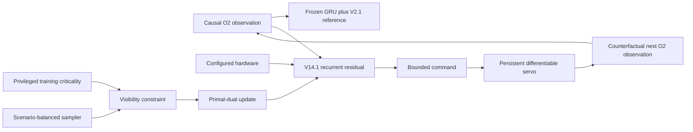

# Deployable Constrained Fine-Tuning V15

## Question

V14 proves a deployable-reference sequence ceiling, and V14.1 transfers most
of it while missing only strict critical-visibility non-regression. V15 asks
whether direct control-aware fine-tuning through recurrent counterfactual
observations and the multi-command servo plant can close that final gap.

The fresh test remains sealed. All model selection uses the original 48-case
development validation set and the unchanged eight-check promotion gate.

## Method

The seed-29 hard-midpoint GRU and V2.1 adapter remain frozen. V15 reconstructs
the deterministic V14.1 epoch-30 bounded residual, then differentiates its
commands through persistent servo latency, acceleration/rate/travel limits,
quantization, camera timing, recurrent policy state, and counterfactual O2
observations.



The primary loss measures ordinary and critical closed-loop tracking, command
smoothness, and plant saturation. Critical visibility is an explicit
primal-dual constraint against the unchanged reference. Ordinary residual
authority is bounded by a trust region calibrated to the initialized V14.1
student. Fine-tuning uses all 288 available oracle-behavior training episodes,
up from the 192 used for initial distillation, with critical and scenario
families deliberately balanced in every batch. All hardware scales remain
serialized inputs rather than constants.

The original exact rollout recomputed every command prefix. V15 introduces
streaming recurrent state for the GRU/V2.1 setpoint filter and latency queue.
Parity tests verify identical commands, angle, rate, applied position, and
saturation against the previous exact sequence implementation.

## Reproduced V14.1 starting point

| Metric | Frozen reference | V14.1 initialization | Relative change |
|---|---:|---:|---:|
| Global tracking RMSE | 1.034254 | 1.008025 | **-2.54%** |
| Critical tracking RMSE | 0.844162 | 0.829956 | **-1.68%** |
| Global visibility RMSE | 0.703894 | 0.673539 | **-4.31%** |
| Critical visibility RMSE | 0.132425 | 0.132825 | **+0.30%** |
| Global smoothness RMSE | 0.056715 | 0.049505 | **-12.71%** |
| Global saturation RMSE | 0.699019 | 0.618610 | **-11.50%** |

## Optimization progression

V15 tests mean constraints, robust training margins, episode CVaR, capped
dual continuation, scenario-max constraints, and finally a small deployable
hardware/evidence-conditioned authority calibrator. No learned arm passes all
eight checks.

| Refinement | Representative frontier point | Critical tracking | Critical visibility | Main failure |
|---|---|---:|---:|---|
| Mean constraint | visibility-safe epoch | +0.01% | 0.00% | tracking gain lost |
| Robust mean margin | epoch 1 | -1.41% | +0.22% | visibility |
| Episode CVaR | visibility-safe epoch | -0.01% | -0.01% | global/critical tracking |
| Capped CVaR, 288 cases | epoch 3 | -1.24% | +0.18% | visibility |
| Scenario-max | epoch 2 | **-0.54%** | +0.12% | visibility only |
| Authority calibrator | epoch 13 | **-0.58%** | +0.20% | visibility only |

The frontier is consistent: states that retain at least 0.5% critical tracking
improvement remain slightly visibility-positive; visibility-safe states lose
the required tracking improvement and eventually regress saturation.

## Failure localization

The aggregate miss is not spread across the validation set. Only three
scenario groups contain critical samples in this focus window:

| Scenario | Critical samples | Tracking change | Visibility change |
|---|---:|---:|---:|
| `high_latency` | 4 | -0.36% | unchanged at zero |
| `slow_servo` | 13 | **+0.65%** | **+1.75%** |
| `aggressive_motion` | 15 | **-4.08%** | effectively unchanged |

All material positive visibility deltas arise in one `slow_servo` episode,
while the aggressive-motion group supplies the useful critical tracking gain.
This explains why aggregate constraint pressure suppresses good behavior.

## Privileged conditional-authority ceiling

A non-deployable diagnostic uses scenario identity to change only the
`slow_servo` residual scale. It is a feasibility screen, not a proposed
controller input.

| Slow-servo authority | Global tracking | Critical tracking | Critical visibility | Global saturation |
|---:|---:|---:|---:|---:|
| 1.00 | -2.54% | -1.68% | +0.3023% | -11.50% |
| 0.75 | -2.51% | -1.78% | +0.1324% | -8.61% |
| 0.50 | -2.54% | -1.73% | +0.0774% | -8.77% |
| 0.25 | -2.55% | -1.95% | +0.0280% | -6.73% |
| 0.00 | **-2.54%** | **-1.97%** | **+0.00008%** | **-6.17%** |

Zero slow-servo authority reaches numerical visibility parity while retaining
both tracking gates and all other material improvements. The residual itself
therefore has a feasible conditional envelope; the present learned calibrator
does not infer the sufficiently sharp routing boundary.

## Verdict and next step

V15 is not promoted and emits no deployable checkpoint. It establishes that:

1. sequence-level gradients and explicit constraints work technically;
2. mean and worst-tail constraints alone couple incompatible scenario groups;
3. the failure is localized to slow actuator dynamics; and
4. scenario-conditional authority has a nearly passing privileged ceiling.

V16 should generate a per-episode or short-horizon **authority oracle** around
the frozen V14.1 residual. Exact counterfactual scale candidates should select
the greatest authority satisfying visibility/saturation constraints. A small
hardware/evidence-conditioned router can then be trained on those
state-consistent authority labels before a low-rate constrained fine-tune.
Scenario identity remains training-only; deployment still uses causal O2 and
configured camera/servo properties. This directly targets the demonstrated
routing problem before adding a more complex command-horizon policy.

Reproduce the experiment family with:

```bash
aol-finetune-gimbal-deployable-constrained
```

Development records are stored in:

- `artifacts/gimbal_deployable_constrained_v15.json`
- `artifacts/gimbal_deployable_constrained_v15_1.json`
- `artifacts/gimbal_deployable_constrained_v15_2.json`
- `artifacts/gimbal_deployable_constrained_v15_3.json`
- `artifacts/gimbal_deployable_constrained_v15_4.json`
- `artifacts/gimbal_deployable_constrained_v15_5.json`
- `artifacts/gimbal_deployable_constrained_v15_6_authority_ceiling.json`
