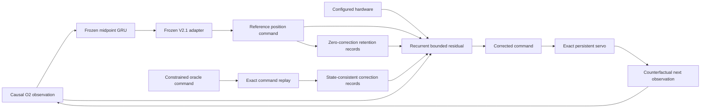

# Deployable-Reference Gated Residual V14.1--V14.3

## Question

V14 proves that constrained privileged sequences can materially improve the
frozen deployable midpoint-GRU/V2.1 position controller. V14.1 asks how much of
that ceiling transfers to a small recurrent direct-command residual trained on
state-consistent oracle replays while explicitly retaining reference behavior.

V14.2 and V14.3 test two narrowly targeted safety refinements after V14.1
misses one gate:

- validation-selected scalar residual authority; and
- a deployable directional visibility shield that backs off corrections which
  move commanded position farther from a valid, high-risk observed target.

The fresh test remains sealed throughout.

## Method

The replicated seed-29 hard-midpoint GRU and hardware-aware V2.1 adapter are
frozen. A zero-initialized recurrent policy adds a bounded normalized correction
to the adapter's absolute position command. Its learned gate receives the
current causal O2 feature, ten normalized hardware values, the frozen reference
command, and six deployable failure-evidence values.



The 192-case training set contains 192 reference-retention sequences and 192
oracle-command replay sequences. The frozen reference command is recomputed on
each corrected observation history; maximum reconstruction disagreement is
`4.84e-7`, consistent with float32 arithmetic. Oracle labels use privileged
future bearing only during training. All selection uses exact counterfactual
closed-loop validation on 48 disjoint development cases.

## V14.1 result

The best arm uses ordinary trust weight 0.25 at epoch 30. Percentages are
relative to the frozen deployable reference; negative values are improvements.

| Metric | Reference | V14.1 student | Relative change |
|---|---:|---:|---:|
| Global tracking RMSE | 1.034254 | 1.008025 | **-2.54%** |
| Critical tracking RMSE | 0.844162 | 0.829956 | **-1.68%** |
| Global visibility RMSE | 0.703894 | 0.673539 | **-4.31%** |
| Critical visibility RMSE | 0.132425 | 0.132825 | **+0.30%** |
| Global smoothness RMSE | 0.056715 | 0.049505 | **-12.71%** |
| Critical smoothness RMSE | 0.080074 | 0.063025 | **-21.29%** |
| Global saturation RMSE | 0.699019 | 0.618610 | **-11.50%** |
| Critical saturation RMSE | 1.153065 | 0.779847 | **-32.37%** |

The student transfers about 55% of the V14 oracle's global tracking gain and
66% of its critical tracking gain. Seven of eight promotion checks pass. The
only failure is strict critical-visibility non-regression, an absolute RMSE
increase of `0.000400` over 32 critical validation commands.

The two stronger trust arms suppress correction and lose critical tracking:

| Trust weight | Global tracking | Critical tracking | Critical visibility |
|---:|---:|---:|---:|
| 0.25 | **-2.54%** | **-1.68%** | +0.30% |
| 1.0 | **-1.71%** | +0.06% | +0.05% |
| 5.0 | **-1.99%** | +0.11% | +0.04% |

The training oracle selects a nonzero sequence in 90.63% of cases. Its command
labels differ from the reference by normalized MAE 0.123 and exceed the gate
threshold on 88.28% of valid steps, so the residual receives a strong signal.

## V14.2/V14.3 safety refinements

V14.2 evaluates every saved checkpoint at residual scales 0.25, 0.50, 0.75,
and 1.0. No scale passes. For the best epoch, scale 0.75 retains 1.32% global
tracking improvement but reduces critical tracking improvement from 1.68% to
0.005%, while critical visibility still regresses 0.13%.

V14.3 tests visibility-shield strengths 0, 0.5, and 1.0 at residual scales 0.75
and 1.0. At full authority the strongest shield changes global/critical
tracking to -2.56%/-1.70% and improves saturation further, but critical
visibility remains +0.30%. The delayed plant and observation dynamics—not an
immediately wrong correction direction—cause the remaining violation.

## Verdict and next step

V14.1--V14.3 are not promoted, and no checkpoint is emitted. This is a strict
near-pass rather than a return to the earlier performance barrier: the learned
residual materially improves tracking, visibility outside the critical subset,
smoothness, and saturation while preserving a deployable frozen base.

The next justified experiment is sequence-level control-aware fine-tuning from
the distilled policy. It should differentiate through the multi-command plant
and optimize tracking subject to an explicit critical-visibility constraint and
an ordinary-state reference trust region. An augmented-Lagrangian or primal-dual
constraint is preferable to another fixed scalar weight or instantaneous
shield because the violation emerges after delayed command/observation effects.
The frozen GRU, adapter, hardware conditioning, state-consistent replay data,
and strict development gate should remain unchanged.

Reproduce the full distillation with:

```bash
aol-distill-gimbal-deployable-sequence-oracle
```

The experiment records are:

- `artifacts/gimbal_deployable_residual_v14_1.json`
- `artifacts/gimbal_deployable_residual_v14_2.json`
- `artifacts/gimbal_deployable_residual_v14_3.json`
