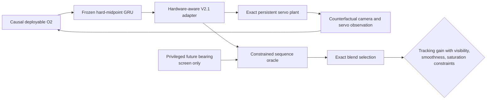

# Deployable-Reference Sequence Oracle V14

## Question

V13 proved that its frozen learned absolute actor was the binding ceiling: even
the constrained oracle around that actor could not match the original
reference. V14 therefore performs the required ceiling-first test around the
actual deployable controller—the replicated hard-midpoint O2 GRU followed by
the hardware-aware V2.1 position adapter—before training another residual.

The answer is **yes**: a substantially better constrained sequence exists, and
every development gate passes. The fresh test remains sealed.

## Protocol

The seed-29 replicated hard-midpoint GRU is frozen. A zero-initialized residual
head is used only to exercise the existing counterfactual command loop; it emits
exactly zero and has no effect on the reference. Starting at episode index zero,
the deployable controller receives only causal O2 observations and retains its
recurrent state through all 16 commands. The V2.1 adapter converts predicted
target state and configured actuator response into absolute position commands.



The screen uses the same 48 development-validation seed/scenario cases as V11,
24 shooting iterations, a bounded normalized command residual, and exact
per-episode blend selection. The unchanged deployable sequence is always a
feasible fallback. Hardware-dependent values remain serialized inputs: FOV,
asymmetric travel, polarity, quantization, latency, lag, position gain and
tolerance, rate and acceleration limits, and all event cadences.

Replaying the generated reference commands through the oracle plant has exactly
zero maximum angle discrepancy, ruling out a plant mismatch.

## Results

| Metric | Deployable reference | Constrained oracle | Relative change |
|---|---:|---:|---:|
| Global tracking RMSE | 1.034254 | 0.986663 | **-4.60%** |
| Critical tracking RMSE | 0.844162 | 0.822593 | **-2.56%** |
| Global visibility RMSE | 0.703894 | 0.672029 | **-4.53%** |
| Critical visibility RMSE | 0.132425 | 0.132386 | **-0.03%** |
| Global smoothness RMSE | 0.056715 | 0.045093 | **-20.49%** |
| Critical smoothness RMSE | 0.080074 | 0.046183 | **-42.33%** |
| Global saturation RMSE | 0.699019 | 0.212055 | **-69.66%** |
| Critical saturation RMSE | 1.153065 | 0.409253 | **-64.51%** |

All eight frozen checks pass. The oracle improves tracking in 93.75% of the 48
episodes, selects the unchanged fallback in only 6.25%, and uses a mean blend
of 0.656. The selected normalized command residual has global RMS 0.144.

The deployable reference differs from the logged privileged-position action by
0.410 normalized RMS. This explains why distilling privileged absolute commands
first created a weak anchor in V11.1--V13. V14 instead improves the controller
that will actually run, without relearning its competent ordinary behavior.

## Verdict and authorized next step

V14 passes the ceiling gate and authorizes state-consistent, failure-gated
distillation around the frozen midpoint-GRU/V2.1 controller. The next student
must:

- keep the GRU and V2.1 adapter frozen;
- learn only a bounded recurrent command correction;
- consume deployable, hardware-relative failure evidence;
- train on observations regenerated by oracle-selected commands;
- retain zero-correction reference trajectories; and
- use exact counterfactual closed-loop validation for selection.

Passing this ceiling does not promote a deployable checkpoint or authorize the
fresh test. The learned residual must independently pass the same gate first.

Reproduce with:

```bash
aol-screen-gimbal-deployable-sequence-oracle
```

The complete development result is
`artifacts/gimbal_deployable_sequence_oracle_v14.json`.
