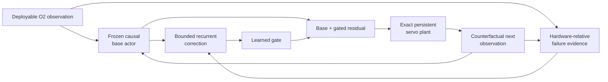

# State-Consistent Failure-Gated Correction V13

## Question

V12 showed that on-policy aggregation can improve rare critical behavior while
moving ordinary behavior too far. V13 tests two proposed remedies together:

1. freeze the causal absolute-position actor and learn only a bounded recurrent
   correction with deployable failure evidence; and
2. remove the sequence-label/state mismatch by replaying every oracle-selected
   command sequence and attaching its labels only to the observations generated
   by that same sequence.

This is a development-only experiment. The fresh test remains sealed.

## Architecture



Failure evidence contains only deployable, normalized quantities: image-error
risk, detector gap, gimbal-rate utilization, travel utilization, measurement
age in camera frames, and body-rate utilization. All thresholds and correction
authority are configurable. Privileged criticality remains training-only.

The residual is initialized to exactly zero, so the untrained wrapper reproduces
the frozen actor. Its maximum normalized correction is 0.40. Base-trajectory
records explicitly supervise zero correction. Corrected records are generated
by the following state-consistent process:

1. roll the frozen actor from episode start using its own causal observations;
2. solve the constrained sequence oracle around that trajectory;
3. replay the selected oracle commands through the exact plant;
4. regenerate image, servo, and previous-action observations from that replay;
5. train the correction using the selected command paired with the regenerated
   observation at the same time step.

Three ordinary-state trust weights—1, 5, and 20—test the retention/performance
tradeoff. Checkpoints are selected only by exact counterfactual closed-loop
validation.

## Results

All percentages below are relative to the logged privileged-position reference;
negative values are improvements.

| Arm | Global tracking | Critical tracking | Global visibility | Global smoothness | Global saturation |
|---|---:|---:|---:|---:|---:|
| Frozen learned base | +9.01% | +4.37% | +9.00% | +11.40% | **-19.05%** |
| State-consistent oracle ceiling around base | +4.57% | +0.64% | +4.99% | **-32.13%** | **-64.91%** |
| Trust 1 | +9.55% | +2.90% | +9.39% | **-8.70%** | **-23.18%** |
| Trust 5 | +8.56% | +4.27% | +8.29% | +2.30% | **-17.69%** |
| Trust 20 | +8.59% | +4.36% | +8.30% | +1.28% | **-17.17%** |

The loose trust-1 arm improves critical tracking by 1.41% relative to the
frozen actor and improves critical smoothness by 37.00% relative to the
reference, but worsens global tracking by 0.50% relative to the actor. Trust 5
improves global tracking by 0.42% relative to the actor while retaining almost
all of its critical behavior. No arm approaches the reference tracking or
visibility contract.

The oracle ceiling is the decisive result. It improves the learned base by
4.07% globally and 3.57% on critical tracking, yet still remains 4.57% and
0.64% worse than the reference. It also regresses visibility. Therefore no
correction policy trained from this ceiling can satisfy the promotion gate.

The base actor is far outside the original teacher distribution: the oracle
selects a nonzero sequence in 93.75% of validation episodes, 92.45% of command
labels exceed the correction threshold, and the mean normalized command change
is 0.106. By comparison, V11 changed only 41% of windows when it began from the
competent privileged-position reference. Ordinary retention cannot bridge that
base-policy deficit without suppressing the corrections entirely.

## Verdict and next gate

V13 fails the promotion gate, and no checkpoint is promoted. The experiment
does validate useful infrastructure:

- zero-initialized base retention;
- deployable hardware-relative failure evidence;
- bounded recurrent correction;
- exact closed-loop gate evaluation; and
- state-consistent oracle-command replay.

The next experiment must change the frozen anchor. It should use the existing
deployable analytical/midpoint-GRU V2.1 position controller directly, rather
than first distilling privileged absolute commands into a weaker base actor.
Before learning any residual, the constrained sequence oracle must be screened
around that deployable reference from episode start. Training is authorized
only if that oracle ceiling already passes global and critical tracking,
visibility, smoothness, and saturation gates. If it passes, V13's gated,
state-consistent correction machinery can distill those corrections without
relearning ordinary control.

Reproduce with:

```bash
aol-develop-gimbal-failure-gated-policy
```

The complete development record is
`artifacts/gimbal_failure_gated_v13.json`.
