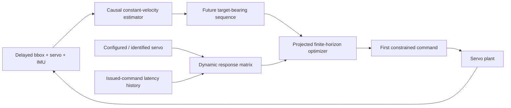

# C4 Identified Constrained MPC Experiment

## Research question

Can a deployable explicit-model predictive controller match or exceed the
current learned controller when both must operate causally through the same
camera, detector, servo, and hardware limits?

C4 is important because beating reactive feedback is not enough to justify
learning. A credible AI contribution must also be compared against a controller
that explicitly predicts the plant and optimizes future actions.

## Method



The target estimator is the conventional IMU-compensated constant-velocity
family already used by C3. This intentionally avoids giving C4 a learned
predictor. The distinction is downstream control:

- C3 selects a forecast and passes it through the V2.1 position adapter.
- C4 optimizes an entire future command sequence through an identified linear
  servo model, then applies the first action and replans.

The model includes configured command latency, rate-loop time constant,
position-loop gain, command polarity, current angle/rate, and previously issued
commands that have not yet reached the actuator. Projected optimization enforces
the physical command range and a hardware-relative command slew limit.

The objective contains normalized tracking error, terminal tracking emphasis,
target-rate matching, uncertainty-expanded visibility risk, command change,
and command effort. All weights, horizons, optimizer iterations, model scales,
and slew scales are configurable. Camera and servo values are never embedded
as fixed constants. Zero gimbal angle remains body forward.

## Identification boundary

The current simulator experiment treats each randomized `ServoConfig` as the
identified plant supplied to the controller. This tests control performance
given a correct nominal model; it does not claim that online system
identification has been solved. Real deployment requires step/chirp data to fit
command latency, rate time constant, position gain, deadband, quantization, and
effective limits. Configurable model scales support later mismatch tests.

The prediction model is deliberately linear. Acceleration clipping, deadband,
quantization, tolerance, and hard travel contact remain in the evaluation plant
but are not all represented exactly inside the optimizer. Their mismatch is a
known limitation rather than privileged information.

## Protocol

- Development worlds: seeds 120000–120007.
- Selection scenarios: nominal combined, high latency, dropout/noise, slow
  servo, and aggressive motion.
- Diagnostic-only during selection: travel-limit recovery.
- Final worlds: seeds 121000–121007, still sealed and unopened.
- Both rate and position command interfaces are selected independently.
- Six candidates cover 200/300/400 ms horizons, smoothness penalties, and
  hardware-relative slew limits.

The full Baseline Benchmark v1 protocol hash is
`473dc5fc3991941d2468bb0cf3cf935b8e070c9726a7ee135e96e7c35c3b3f0d`.

## Selection result

| Mode | Selected configuration | Mean error | P95 | Lost view | Variation/s | Score |
|---|---|---:|---:|---:|---:|---:|
| Position | 200 ms, change weight 5, slew 0.75 | **9.09°** | **21.56°** | **2.91%** | **0.756** | **0.381** |
| Rate | 300 ms, change weight 10, slew 1.00 | 12.62° | 28.48° | 6.19% | 1.141 | 0.706 |

Position is the locked C4 interface. The rate arm is retained as an ablation.

## Six-scenario development comparison

| Controller | Mean error | P95 | Lost view | Variation/s | Control cost |
|---|---:|---:|---:|---:|---:|
| C2 robust PID, rate | 17.05° | 33.02° | 13.22% | 1.174 | 1.014 |
| C3 conventional champion | 13.41° | 28.94° | 11.60% | 1.039 | 0.767 |
| C4 identified MPC, position | 13.27° | 29.04° | 11.27% | **0.670** | 0.751 |
| Dream-to-Center, three seeds | **13.06°** | **28.24°** | **10.96%** | 1.048 | **0.735** |

C4 narrowly improves the development aggregate over C3: 0.14° lower mean
error, 0.32 percentage points less loss of view, 35.5% less command variation,
and 2.0% lower control cost. C3 retains a 0.10° P95 advantage.

Dream-to-Center in turn improves over C4 by 0.21° mean error, 0.80° P95,
0.32 percentage points loss of view, and 2.2% control cost. C4 retains the
clear smoothness advantage: 36.1% less command variation.

### Scenario structure

| Scenario | C4 mean | C3 mean | C4 − C3 | C4 loss | C3 loss |
|---|---:|---:|---:|---:|---:|
| Nominal combined | 6.52° | **6.00°** | +0.52° | 0.00% | 0.00% |
| High latency | **8.75°** | 8.84° | −0.09° | **0.67%** | 1.66% |
| Dropout/noise | 6.65° | **6.32°** | +0.33° | 0.09% | **0.00%** |
| Slow servo | **10.21°** | 10.80° | −0.60° | **2.26%** | 2.83% |
| Aggressive motion | **13.34°** | 13.58° | −0.24° | **11.50%** | 11.99% |
| Travel-limit recovery | **34.15°** | 34.91° | −0.75° | 53.12% | 53.12% |

The benefit is concentrated where plant prediction should matter: sensing
delay, slow actuation, aggressive motion, and constrained recovery. C3 remains
better in clean nominal tracking and noisy detections. Both still fail badly on
many randomized travel-limit worlds, so MPC does not remove the need for an
explicit search/re-entry strategy.

### C4 versus Dream-to-Center

| Scenario | C4 mean | GRU mean | GRU − C4 | C4 loss | GRU loss |
|---|---:|---:|---:|---:|---:|
| Nominal combined | 6.52° | **5.67°** | −0.85° | 0.00% | 0.00% |
| High latency | **8.75°** | 9.38° | +0.63° | **0.67%** | 0.89% |
| Dropout/noise | 6.65° | **6.17°** | −0.48° | 0.09% | **0.06%** |
| Slow servo | 10.21° | **10.20°** | −0.01° | **2.26%** | 3.22% |
| Aggressive motion | 13.34° | **12.04°** | −1.30° | 11.50% | **8.45%** |
| Travel-limit recovery | **34.15°** | 34.90° | +0.75° | 53.12% | 53.12% |

The learned advantage is concentrated in nominal tracking and aggressive
motion. C4 is better under high detector latency and travel-limit recovery and
is smoother in every scenario. Slow-servo mean tracking is tied, but C4 loses
view less often.

## Arena result

On the historical default high-latency replay, using exactly paired world
state and randomness:

| Controller | Mean error | P95 | Lost view | Variation/s |
|---|---:|---:|---:|---:|
| C4 identified MPC | 7.01° | 22.28° | 0.00% | **0.833** |
| C3 conventional champion | **6.66°** | **21.95°** | 0.00% | 1.166 |
| Dream-to-Center | 9.34° | 21.96° | 0.00% | 2.795 |

Here the learned controller is worse than both conventional predictive
controllers on mean error and command smoothness. That verdict is the desired
effect of introducing C4: it raises the comparison from “better than a
heuristic” to “competitive with a real predictive controller.”

## Interpretation

C4 becomes the strongest conventional development baseline, but only narrowly
over C3 and without fresh-test evidence. Dream-to-Center shows a small aggregate
tracking and visibility advantage over C4, so there is evidence of learned
value beyond explicit MPC—but not broad dominance. The research opportunity is
now sharper: preserve the learned advantage on aggressive motion while reaching
C4 smoothness and avoiding its regressions under high latency, slow-servo
visibility, and travel-limit recovery.

## Reproduction

```bash
aol-develop-gimbal-baseline-benchmark
scripts/open_gimbal_challenge_arena.sh
```

Restore C2 or C1 in the first arena column with:

```bash
scripts/open_gimbal_challenge_arena.sh \
  --arena-feedback-controller robust-pid

scripts/open_gimbal_challenge_arena.sh \
  --arena-feedback-controller practical
```
