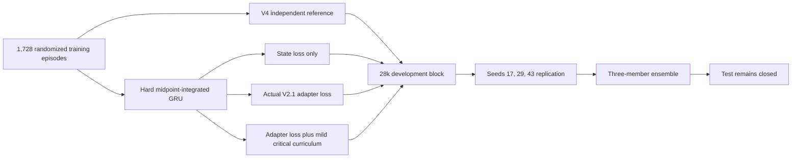

# Hard Midpoint Dynamics and Adapter Objective V7

## Research question

V6/V6.1 showed that the actual V2.1 position-adapter loss could improve both
global and critical command accuracy, but independent future-bearing heads
learned dynamically incoherent trajectories. Increasing the soft consistency
coefficient did not robustly solve that conflict.

V7 therefore asked whether hard midpoint-integrated target dynamics could
retain the controller gains while making cross-horizon consistency exact by
construction.

## Protocol



The fresh development block uses simulator seeds 28000--28007, 288 randomized
episodes, six scenario families, all six rate/position collection behaviors,
and all three deployable observation profiles. V7 kept the 36,240-parameter
model size and the O2 deployment input schema fixed.

For the hard midpoint model, adjacent bearing heads are generated by Simpson
integration:

\[
\hat\theta_{k+1} = \operatorname{wrap}\left(
\hat\theta_k + \frac{\Delta t_k}{6}
(\hat\omega_k + 4\hat\omega_{k+1/2} + \hat\omega_{k+1})
\right).
\]

The latent midpoint rate preserves acceleration and curvature capacity while
preventing the adapter objective from exploiting mutually inconsistent bearing
heads. The mild curriculum uses concentration strength 1.0, increasing
expected critical-label exposure from 16.53% to 22.98%; V6 used strength 2.0
and 25.17% exposure.

## Development factorial

All changes below are relative to a newly trained, seed-matched V4 reference.
Negative values are improvements.

| Candidate | Average bearing | Average rate | 100 ms bearing | Critical bearing | Critical rate | Adapter action | Critical action | Result |
|---|---:|---:|---:|---:|---:|---:|---:|---|
| **Midpoint state only** | **-2.40%** | +0.74% | **-3.62%** | **-1.90%** | +1.97% | **-2.95%** | **-3.24%** | **Pass** |
| Midpoint + adapter 0.15 | +4.00% | +1.35% | +3.43% | +1.44% | +1.44% | +7.03% | -0.12% | Fail |
| Midpoint + adapter 0.15 + mild curriculum | +2.28% | -2.85% | +2.12% | -6.11% | -3.10% | +0.81% | -7.51% | Fail |
| Midpoint + adapter 0.25 + mild curriculum | +3.98% | -3.16% | +3.65% | -4.81% | -3.20% | +5.05% | -5.66% | Fail |

Every midpoint arm reduces the dynamic residual to approximately
`1.3e-6 deg`, versus `0.81 deg` for V4. The state-only midpoint model is the
only arm that passes all frozen guards. Its critical-rate regression is 1.97%,
only 0.03 percentage points inside the 2% ceiling, so replication was required.

The adapter-loss arms are an important negative result. Critical sampling
improves critical metrics but moves error back into the ordinary distribution;
without sampling, command imitation makes both state and global adapter action
worse. Once dynamics are structurally constrained, the privileged command
target adds no reliable benefit over state learning alone.

## Seed-matched replication

V4 and midpoint state-only models were trained in pairs for GRU seeds 17, 29,
and 43. The test remained closed.

| Mean over three seeds | V4 | Midpoint | Relative change |
|---|---:|---:|---:|
| Average bearing RMSE | 13.76 deg | 13.31 deg | **-3.29%** |
| Average rate RMSE | 25.95 deg/s | 26.29 deg/s | +1.33% |
| 100 ms bearing RMSE | 13.37 deg | 12.83 deg | **-4.04%** |
| Critical 100 ms bearing RMSE | 10.42 deg | 10.47 deg | +0.45% |
| Critical 100 ms rate RMSE | 36.30 deg/s | 36.68 deg/s | +1.04% |
| Dynamic consistency RMSE | 0.905 deg | 0.0000013 deg | **approximately -100%** |
| Adapter-action RMSE | 0.2029 | 0.1956 | **-3.59%** |
| Critical adapter-action RMSE | 0.3112 | 0.3132 | **+0.66%** |

Seeds 17 and 29 pass individually. Seed 43 fails:

| Seed 43 metric | Relative change |
|---|---:|
| Average rate | +3.19% |
| Critical bearing | +5.13% |
| Critical rate | +2.75% |
| Adapter action | +2.03% |
| Critical adapter action | +6.82% |

The replication fails the mean critical-action gate, per-seed state safety,
and per-seed action safety. The development pass is therefore not promoted.

## Causal ensemble check

A three-member ensemble was evaluated without retraining. Bearings use a
circular mean; rates use an arithmetic mean; uncertainty uses the law of total
variance, preserving both aleatoric uncertainty and member disagreement. A
matched three-member V4 ensemble is the reference.

| Ensemble metric | Relative change |
|---|---:|
| Average bearing | -3.83% |
| Average rate | +1.45% |
| 100 ms bearing | -4.63% |
| Critical bearing | -0.61% |
| Critical rate | +0.99% |
| Dynamic consistency | -99.85% |
| Adapter action | -4.70% |
| Critical adapter action | **-0.20%** |

The ensemble passes every guard except the required 1% critical-action
improvement. It also triples deployable parameters from 36,240 to 108,720.
It is not promoted.

## Verdict

V7 provides evidence for three narrower conclusions:

1. Hard midpoint dynamics is better than a soft consistency penalty for
   ordinary bearing prediction, global adapter action, and exact coherence.
2. That improvement is initialization-sensitive at controller-critical states.
3. Privileged command imitation is not equivalent to optimizing closed-loop
   tracking. It replays commands against logged gimbal telemetry, so it does
   not model how the student's counterfactual command changes future plant and
   image states.

V4 remains the selected single model. Neither midpoint replication nor the
ensemble qualifies for a fresh test, and no test block was opened.

## Recommended next research step

Retain hard midpoint dynamics, but replace command imitation with a short
differentiable closed-loop rollout objective. Starting from serialized episode
hardware and state, roll the predicted V2.1 command through the configurable
servo plant and score future image error, visibility margin, command variation,
and saturation against privileged target motion. This makes the auxiliary loss
outcome-aware rather than command-aware.

The first implementation should be validated for one-step and multi-step parity
against the existing simulator before another training screen. It should use a
new development block and retain the same state, rate, consistency, and
critical-state safety guards.

Reproducible entry points:

```bash
aol-develop-gimbal-midpoint-adapter
aol-replicate-gimbal-midpoint-adapter
aol-evaluate-gimbal-midpoint-ensemble
```

Generated datasets, checkpoints, and result JSON files remain under ignored
`artifacts/` paths.
