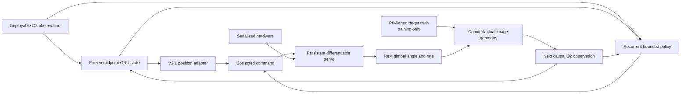

# Multi-Command Counterfactual Policy V10

## Research question

V8.9 froze the target-state estimator and learned a bounded control residual,
but its differentiable plant held one command for 300 ms. It could not learn
how an action changes the next gimbal state, image error, estimator update, and
subsequent action. V10 asks whether an explicitly causal, recurrent command
sequence closes that gap without changing the validated state estimator.

This is a development experiment. The fresh test remains sealed.

## Method

The 36,240-parameter seed-29 hard-midpoint GRU is frozen. A zero-initialized
8,961-parameter residual policy receives the current deployable O2 feature,
the frozen model's four bearing/rate means and uncertainties, and the
hardware-derived arrival and requested prediction horizons. Its recurrent
state is updated once per control command. The residual magnitude and its
application point are configurable:

- `target_half_fov` adds a bounded half-FOV correction before the V2.1
  hardware-aware setpoint filter;
- `command_normalized` adds a bounded correction directly to the normalized
  position command after that filter.

Every hardware-dependent quantity comes from serialized episode context:
asymmetric travel, body-forward zero, polarity, quantization, latency, rate
lag, rate/acceleration limits, position gain/tolerance, camera cadence,
control cadence, and integration cadence.



### Persistent plant state

The rollout applies eight changing commands instead of repeating one command.
Pending command arrivals persist across control boundaries. Camera and command
events split numerical integration at their actual timestamps. A changing
four-command parity test with non-grid-aligned latency, camera cadence,
quantization, lag, and acceleration limits matches the existing simulator to
`2e-12`. Gradients reach multiple earlier commands.

### Counterfactual observations

At each subsequent step, V10 regenerates only fields affected by the policy:

- gimbal angle, rate, and their normalized forms;
- previous normalized and absolute position command; and
- image error and geometry validity at the causally associated capture time.

Frame release, detector age/dropout, body rate, bbox extent when visible, and
confidence when visible remain exogenous. A detector release can use only a
simulated capture at or before its timestamp. Tests verify that changing a
future logged feature cannot change earlier commands.

### Training and selection

Training uses random eight-command windows, critical-episode curriculum
sampling, per-step critical weighting, and a terminal tracking emphasis. The
scalar loss contains multi-step tracking, visibility, command smoothness,
plant saturation, and residual magnitude. Approximate 10 ms integration ranks
epochs; the three best are recomputed with each episode's exact serialized
integration period.

The frozen promotion gate requires both global and critical tracking to
improve by at least 0.5%, visibility and smoothness not to regress, teacher
action error to remain within 2%, and saturation to remain within 5%.

## Development results

Negative relative change is better. Values below are exact reevaluations on
the untouched seed-29 development block; no fresh-test result was opened.

| Arm and representative epoch | Global tracking | Critical tracking | Global visibility | Global smoothness | Global saturation | Result |
|---|---:|---:|---:|---:|---:|---|
| V10 target residual, epoch 2 | **-0.010%** | +0.003% | **-0.027%** | **-0.241%** | **-0.696%** | Fail tracking gates |
| V10.1 direct command residual, epoch 1 | **-0.003%** | +0.000% | **-0.009%** | **-0.021%** | **-0.043%** | Fail tracking gates |
| V10.1 later/high-authority, epoch 6 | +0.065% | **-0.113%** | +0.290% | **-5.910%** | **-4.646%** | Fail tracking and visibility |
| V10.2 privileged bridge, epoch 3 | +0.194% | **-0.018%** | +0.342% | **-1.631%** | **-0.979%** | Fail tracking and visibility |

The V10.2 reference and representative exact candidate make the scale clear:

| Metric | Frozen reference | V10.2 epoch 3 | Relative change |
|---|---:|---:|---:|
| Global tracking RMSE | 0.669505 | 0.670802 | +0.194% |
| Critical tracking RMSE | 1.181195 | 1.180985 | **-0.018%** |
| Global visibility RMSE | 0.319953 | 0.321046 | +0.342% |
| Global smoothness RMSE | 0.208161 | 0.204765 | **-1.631%** |
| Global teacher-action RMSE | 0.243699 | 0.239323 | **-1.796%** |
| Global saturation RMSE | 1.065280 | 1.054857 | **-0.979%** |

## Flat-gradient ablation

The exact plant clips desired rate and acceleration. In saturated critical
states, local tracking gradients can therefore be zero even when a materially
different command would improve the trajectory. V10.2 adds a configurable
privileged V2.1 action loss as a training-only bridge across this plateau. The
deployable inputs and selection metrics do not receive privileged state.

With weight 7.5, direct command residual magnitude 0.25, and twelve epochs,
the bridge does reduce teacher-action error and command variation. It does not
produce the required tracking improvement. Later epochs reach up to 16.7%
smoother global commands but worsen global tracking by 0.5--1.0% and visibility
by 1.2--2.6%. The bridge crosses the local plateau but points toward a
privileged controller that is not a sufficient command-sequence oracle for the
closed-loop objective.

## Interpretation

V10 successfully supplies the missing experimental machinery:

1. changing commands with a persistent latency queue;
2. recurrent policy state;
3. causal counterfactual image and servo observations;
4. exact hardware-randomized reevaluation; and
5. frozen state-estimation behavior by construction.

It does **not** establish a better controller. More command authority mostly
buys smoothness and reduced saturation. Critical tracking can improve slightly
while ordinary-state tracking and visibility deteriorate, reproducing the
ordinary/critical conflict under a substantially more faithful rollout. The
target-space, direct-command, and privileged-gradient-bridge hypotheses all
fail the predeclared gate, so no V10 checkpoint is promoted and independent
seed replication is not justified.

The rollout is still a short-window approximation. The frozen estimator is
warmed from logged history, but the residual-policy state starts cold at the
window boundary, and pending commands issued before the window are represented
by the measured initial angle rather than reconstructed queue contents. These
limitations make V10 a stronger local controller test, not a full-episode
on-policy simulation.

## Next justified experiment

The next step should change the source of trajectory supervision, not tune
another scalar weight. Use a privileged finite-horizon command-sequence oracle
(differentiable shooting, constrained MPC, or sampling-based trajectory
optimization) against the exact plant, including visibility and smoothness as
constraints. Generate from episode start so policy memory, setpoint dynamics,
and the latency queue have exact histories. Distill those state-conditional
sequences into the causal recurrent policy, then aggregate examples
specifically where the student and oracle diverge or where saturation makes
local gradients flat. This would test whether a useful command sequence exists
before asking the policy to discover it through a conflicted scalarized
gradient.

Reproduce the configurable V10 protocol with:

```bash
aol-develop-gimbal-multi-command-policy
```

Result JSON and any passing checkpoint are written only under ignored
`artifacts/` paths.
