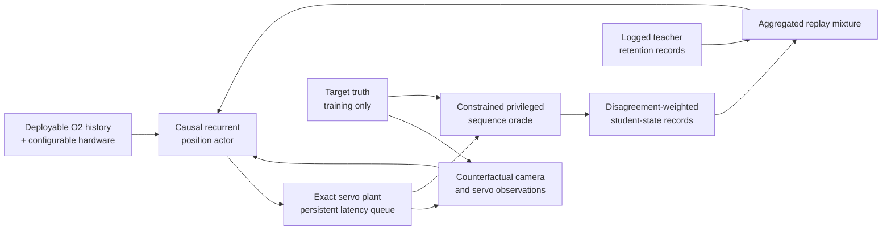

# On-Policy Sequence-Oracle Aggregation V12

## Question

V11.2 showed that adding more logged teacher trajectories reduces—but does not
remove—the sequence-distillation error. More importantly, its selector still
issued commands from logged observations. V12 asks whether a DAgger-style
student-state dataset can close that distribution gap without sacrificing the
sequence oracle's tracking, visibility, smoothness, and saturation contract.

## Method

The absolute-position student retains its causal GRU state and its own previous
command. Every validation and aggregation trajectory is now closed loop:



Detector release timing remains the logged exogenous schedule. Image error and
visibility are regenerated from target truth and the student-induced gimbal
trajectory; target truth never enters the actor. The exact serialized position
plant retains command latency across all 16 commands. Hardware conditioning
continues to expose FOV, asymmetric travel, rate and acceleration limits,
position gain, command latency, rate time constant, control period, and camera
period as configurable inputs.

The first stage trains on 192 logged constrained-oracle sequences. Each of two
aggregation rounds then:

1. rolls the selected student through its own causal observations;
2. optimizes a constrained oracle sequence around each student sequence;
3. appends all corrected student states, with extra weight on disagreement and
   controller-critical samples; and
4. retrains on the growing mixture while retaining the original logged set.

Checkpoint selection uses counterfactual closed-loop tracking, visibility,
smoothness, and saturation on 48 development-validation cases. The fresh test
remains sealed.

## Results

All changes below are relative to the logged privileged-position reference;
negative values are improvements.

| Arm | Global tracking | Critical tracking | Global visibility | Global smoothness | Global saturation |
|---|---:|---:|---:|---:|---:|
| Constrained oracle ceiling | **-0.64%** | **-1.92%** | -0.001% | **-9.59%** | **-13.39%** |
| Teacher-forced actor, counterfactual evaluation | +9.01% | +4.37% | +9.00% | +11.40% | **-19.05%** |
| DAgger round 1 | +9.97% | +0.85% | +10.18% | **-29.41%** | **-37.83%** |
| DAgger round 2 | +10.35% | **-1.21%** | +10.83% | **-27.88%** | **-37.25%** |

The second round also improves critical smoothness by 55.57% and critical
saturation by 72.05%, but critical visibility regresses 1.53%. Only 32 of 768
validation commands are marked critical, so this tail improvement does not
compensate for the dense ordinary-state regression.

The aggregation signal is strong rather than starved. The constrained oracle
changes 92.19% of round-one student sequences with a normalized command-label
MAE of 0.106. In round two those values fall to 87.50% and 0.067. Thus the
student moves outside the logged teacher distribution, the oracle consistently
finds safer corrections, and the correction magnitude decreases after one
round. The remaining failure is transfer of those corrections without moving
the ordinary-state policy too far.

## Verdict

V12 does not pass the promotion gate and no checkpoint is promoted. It does
validate the central distribution-shift hypothesis: teacher-forced performance
looks substantially better than the same actor under causal counterfactual
feedback, and student-state aggregation converts the critical tracking
regression into an improvement. However, unconstrained absolute-command
imitation trades ordinary tracking and visibility for tail behavior and actuator
smoothness.

The next experiment should make that trade explicit rather than add more
aggregation rounds. A baseline-retaining, failure-gated correction policy—or a
direct differentiable rollout objective with an ordinary-state trust region—can
use the V12 student-state records while preventing corrections in states where
the reference already works. Sequence labels should also be made state
consistent, because later oracle commands currently correspond to the
oracle-corrected rollout while their observation records come from the original
student rollout.

Reproduce with:

```bash
aol-aggregate-gimbal-sequence-oracle
```

The full development record is
`artifacts/gimbal_on_policy_distillation_v12.json`.
