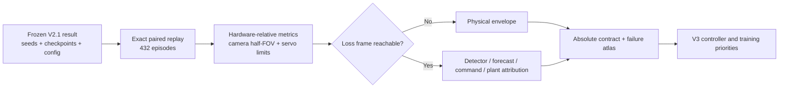

# Position Performance Contract and Failure Atlas

## Purpose

The V2.1 confirmation gate established a relative result: visibility-risk
position control was acceptably close to its frozen references and preserved a
smoothness margin. Visual inspection showed that this did not establish useful
absolute performance. This experiment therefore freezes V2.1 and asks two new
questions:

1. Does any current position controller meet a declared absolute contract?
2. Which physical or algorithmic mechanisms account for the remaining losses?

No threshold or controller parameter is selected on the confirmation replay.
The atlas replays all eight 82000-series confirmation worlds, six scenario
families, three GRU initializations, and the same fixed/V2/V2.1 controllers.



## Configurable contract

The checked-in
[`configs/gimbal_performance_contract.json`](../../../configs/gimbal_performance_contract.json)
is a provisional research stretch target. Angular errors are fractions of the
configured selected-axis camera half-FOV, not assumptions about a particular
lens. Rate, acceleration, and saturation quantities use the configured servo
limits. Camera FOV, servo travel, servo dynamics, and every attribution
threshold remain configurable.

The primary targets are:

| Metric | Provisional limit |
|---|---:|
| Mean absolute error | 25% of camera half-FOV |
| Episode P95 error | 60% of camera half-FOV |
| Total loss of view | 1.0% |
| Loss while mechanically reachable | 0.5% |
| Unrecovered-at-cutoff events | 0 |
| Maximum observed recovery | 0.75 s |
| Position-command variation | 1.25/s |
| Actuator acceleration RMS | 65% of configured limit |

`travel_limit_recovery` remains in the atlas as an envelope/recovery audit but
is excluded from the primary tracking contract.

## Result

All three controllers pass only **4 of 10** aggregate absolute checks on the
five primary tracking families.

| Controller | Mean / half-FOV | P95 / half-FOV | Lost view | Avoidable loss | Variation/s | Unrecovered at cutoff |
|---|---:|---:|---:|---:|---:|---:|
| Fixed learned horizon | 32.64% | 76.47% | **3.68%** | **2.41%** | 1.230 | 21 |
| Adaptive V2 | 32.83% | 76.23% | 4.01% | 2.74% | **1.099** | 21 |
| Visibility-risk V2.1 | 32.78% | **75.84%** | 3.94% | 2.67% | 1.169 | 21 |

V2.1 remains a small trade-off, not a performance breakthrough. Versus fixed
horizon it improves mean episode P95 by 0.63 percentage points of half-FOV and
command variation by 0.061/s, but worsens total/avoidable loss by 0.262
percentage points. Versus V2 it improves loss by only 0.068 percentage points
and P95 by 0.387 percentage points while adding 0.070/s command variation.

## Where performance fails

V2.1's 100 loss events in the five primary families are attributed as follows:

| Failure class | Events | Interpretation |
|---|---:|---|
| Servo-rate capacity at onset | 81 | Interception begins too late for the configured plant/motion pair |
| Physical camera/travel envelope | 13 | No controller can point the target into view with that randomized hardware |
| Detector gap | 3 | Recent causal visual support is insufficient |
| Servo-acceleration capacity at onset | 2 | The relative motion changes faster than the configured acceleration envelope |
| Forecast error | 1 | The causal target forecast is already outside its declared error budget |

Eighty-one of the 100 events occur within the configured 0.4 s neighborhood of
a target/body relative-rate reversal. Causes use evidence available only
through the first lost frame, so later invalid detections cannot be mislabeled
as the cause. The main actionable concentration is
`aggressive_motion`: P95 exceeds the camera half-FOV, loss reaches 11.90%, and
11.05% is mechanically reachable loss. Seventy-three of its 78 events begin near
the servo-rate-capacity condition. `slow_servo` contributes another 1.89%
avoidable loss, and `high_latency` contributes 0.91%.

The aggregate error budget also remains too large: V2.1 mean forecast error,
oracle-arrival command error, and plant setpoint-tracking error are 22.0%,
20.6%, and 32.3% of camera half-FOV. This supports improving the predictor and
controller jointly rather than adding another scalar preview heuristic.

The 21 losses reported as unrecovered all reach an episode boundary and are
therefore right-censored. They still violate the contract because the target
is absent at cutoff, but the replay cannot claim that recovery after the
cutoff would be impossible.

## V3 decision

The next controller should be a servo-aware constrained predictive position
controller:

1. use the multi-horizon GRU distribution rather than selecting one lead;
2. predict applied gimbal state with the configured command latency, bandwidth,
   rate, acceleration, travel, and jerk constraints;
3. optimize pointing error, visibility margin, action change, and terminal
   reachability over a short horizon;
4. train or fine-tune the predictor with servo-arrival pointing and
   loss-of-view penalties; and
5. retain a separate hardware/mission-envelope verdict so physically
   impossible worlds are never presented as controller failures.

Rate commands remain a supported hardware adapter and ablation. Position is
the primary V3 outer-loop action because it remains smoother and easier to
constrain in the current plant.

## Reproduce and inspect

Build the full atlas:

```bash
aol-analyze-gimbal-position-performance \
  --contract configs/gimbal_performance_contract.json \
  --output artifacts/gimbal_position_failure_atlas.json
```

Open the dashboard with mouse clicks by launching:

```bash
scripts/open_gimbal_failure_atlas.sh
```

The dashboard compares all three controllers by scenario, overlays the
absolute limits, separates total from mechanically avoidable loss, and shows
the loss-event cause counts and V3 priorities.
