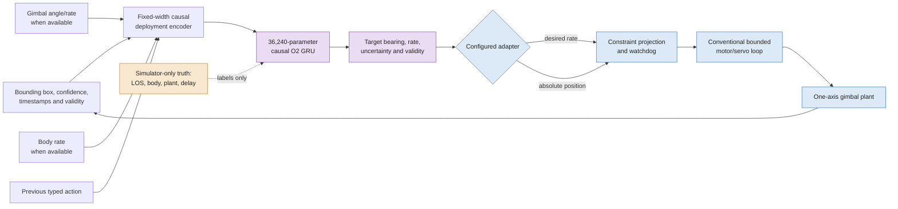
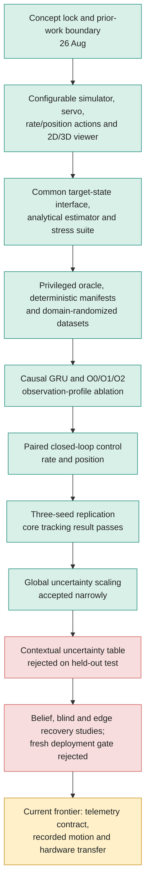
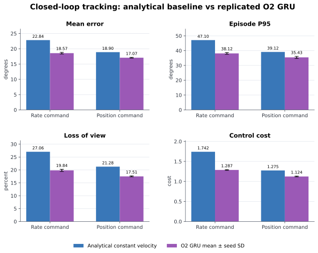
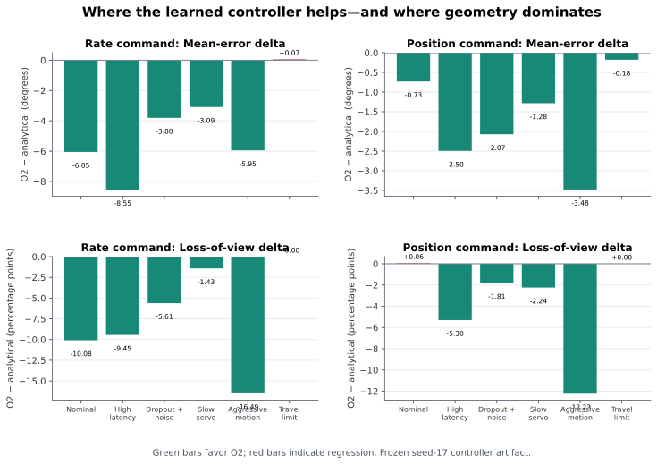
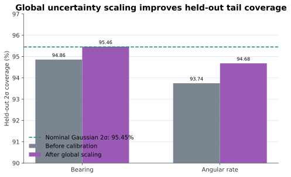
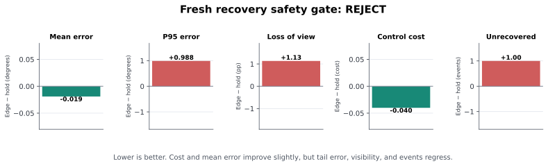

# Dream-to-Center: A Research Journey Toward Predictive One-Axis Gimbal Servoing

**Autonomous Observation Lab — Technical Research Retrospective**<br>
**Project period covered:** 26–31 August 2026<br>
**Status:** synthetic research prototype; not a deployment or novelty claim

## Abstract

This report traces the development of a configurable predictive visual-servo
system for a custom one-axis camera gimbal intended for quadcopter deployment.
The task is to keep a designated bounding box centered despite target motion,
vehicle rotation, detector delay and dropout, and uncertain actuator dynamics.
The implemented system combines a 36,240-parameter causal gated recurrent unit
(GRU), trained with privileged simulator target-state labels but restricted to
deployable inputs at runtime, with conventional desired-rate or
absolute-position command adapters and an independent bounded servo model.

Across three independent training initializations and 24 paired randomized test
worlds, the disturbance-aware GRU improves all declared core tracking metrics
over an analytical constant-velocity controller in both command modes. For rate
control, mean error falls from 22.84° to 18.57 ± 0.27°, episode P95 from 47.10°
to 38.12 ± 0.58°, and loss of view from 27.06% to 19.84 ± 0.43%. Position
control shows smaller but replicated gains. These improvements are strongest
under high latency and aggressive motion and vanish at a physically
unreachable travel-limit ceiling.

The result is promising but incomplete. Rate commands are less smooth,
post-loss recovery is slower in the original closed-loop comparison, and every
directed recovery design tested so far fails a fresh safety gate. Uncertainty
scaling improves held-out 2σ coverage but does not fully calibrate the residual
distribution. The evidence therefore supports a narrow conclusion: learned
temporal target-state inference outperforms the present reactive and
model-based baselines in randomized simulation, but recovery, absolute mission
requirements, embedded timing, recorded flight motion, and physical hardware
transfer remain unresolved.

**Keywords:** visual servoing, gimbal control, recurrent neural network,
privileged supervision, disturbance awareness, sim-to-real, uncertainty,
loss-of-view recovery

---

## 1. Introduction

A camera mounted on a moving quadcopter does not observe target motion in
isolation. Its image-plane error combines at least four causes:

1. target motion in the world;
2. vehicle body rotation;
3. delayed and imperfect gimbal response; and
4. delayed, noisy, or missing detector measurements.

A proportional controller can react to the current bounding-box displacement,
but it cannot determine which hidden cause produced that displacement. A
constant-velocity estimator adds explicit temporal structure, yet it assumes
that recent motion will continue. That assumption becomes fragile during body
maneuvers, reversals, prolonged dropouts, and uncertain actuator lag.

The project began with the question:

> Can a compact recurrent visual servo infer enough hidden target, disturbance,
> delay, and actuator state from causal deployment signals to reduce tail error
> and loss of view under unseen motion and hardware variation?

The initial concept proposed a complete deterministic recurrent actor,
potentially fine-tuned with continuous-control reinforcement learning. The work
completed so far deliberately stops earlier. The validated learned component is
a supervised causal GRU target-state estimator. Conventional, configurable
adapters convert its estimated bearing and angular rate into rate or position
commands. This separation lets us test whether learned temporal state is useful
before attributing gains to end-to-end policy optimization.

The contribution at this stage is therefore an experimental package rather
than a finished controller claim:

- a deterministic configurable gimbal benchmark and visualizer;
- a common target-state interface for analytical, learned, and privileged
  estimators;
- a leakage-controlled privileged dataset pipeline;
- a compact causal GRU with uncertainty outputs;
- paired rate/position closed-loop comparisons and multi-seed replication;
- uncertainty and recovery safety protocols that preserve negative results; and
- exact replay and mouse-openable verification dashboards.

Target centering, predictive pan–tilt control, and learned visual servoing are
established research areas [1–4]. The project does not claim that using AI on a
gimbal is novel. Its candidate research value lies in controlled evidence about
when deployable recurrent state helps under disturbance, delay, and plant
variation.

## 2. Problem formulation and system boundary

The study controls one rotational axis. Zero gimbal position always means body
forward. All camera and actuator quantities—including field of view, frame
rate, detector latency, travel, rate, acceleration, lag, deadband,
quantization, and command delay—are configuration values rather than embedded
hardware assumptions.

For a selected normalized image coordinate $e_t\in[-1,1]$, the deployable
observation is drawn from

\[
o_t=(e_t,w_t,h_t,c_t,m_t,\Delta t_t,q_t,\dot q_t,
\omega_t^{body},u_{t-1}),
\]

with an explicit validity mask for every optional signal. The estimator emits

\[
\hat s_t=(\hat\theta_t^{target/body},
\hat{\dot\theta}_t^{target/body},
\sigma_{\theta,t},\sigma_{\dot\theta,t},m_t),
\]

including measurement time and prediction horizon. A configured adapter then
produces one bounded logical action:

\[
u_t^{rate}=\operatorname{clip}\left(
\frac{\hat{\dot\theta}_t+k_p(\hat\theta_t-q_t)}{\dot q_{max}},-1,1
\right),
\]

or an absolute body-relative position command obtained by mapping the bounded
target bearing into the configured asymmetric travel interval. The simulated
or embedded inner loop remains responsible for realizing that command safely.



**Figure 1. System boundary.** Privileged truth supervises learning but is never
an actor input. The GRU estimates target state; conventional adapters and the
inner servo retain the command and safety boundary.

Three observation profiles isolate the value of deployment telemetry:

| Profile | Runtime inputs | Experimental role |
|---|---|---|
| O0 vision-only | bbox, timing, confidence, previous action | hardest partial-observation ablation |
| O1 servo-aware | O0 plus gimbal angle and rate | payload-local deployment profile |
| O2 disturbance-aware | O1 plus vehicle body rate | strongest currently tested profile |
| OP privileged | true LOS, motion, plant and delay state | labels and ceiling only |

## 3. The research journey

The original five-step program has been completed and extended through
replication, uncertainty, and recovery safety testing.



**Figure 2. Development trajectory.** Rejected experiments were retained rather
than silently optimized away. The current transition is from synthetic policy
validation to measurement and transfer.

| Planned step | Implemented result | Status |
|---|---|:---:|
| Extract analytical predictor into a common state interface | timestamped bearing/rate/uncertainty contract plus truth visualization | complete |
| Build a latency, dropout, lag, motion, saturation and recovery suite | six closed-loop families plus seven expanded recovery families | complete |
| Add a privileged oracle | separate labels and rate/position ceiling controller | complete |
| Train a compact causal temporal model | 64-state, one-layer GRU at four horizons | complete |
| Compare observation profiles and baselines | O0/O1/O2 open-loop, paired closed-loop, rate/position and three seeds | complete |
| Calibrate uncertainty | accepted global scaling; rejected contextual table | complete |
| Establish safe recovery | multiple mechanisms evaluated; none deployment-eligible | open |
| Add servo-aware constrained position optimization | V3 improves aggressive visibility/smoothness but fails tracking gate; V3.1 fails development | rejected |
| Train a control-aware predictor | FOV/servo-weighted future-state and regret objective | next |
| Transfer to the custom gimbal | telemetry and hardware parameters not yet recorded | next |

## 4. Experimental method

### 4.1 Configurable plant and sensing

Each episode combines independently randomized target and vehicle angular
motion with a one-axis gimbal plant and camera/detector process. The plant
supports rate and acceleration limits, command latency, first-order rate lag,
deadband, quantization, and hard travel limits. The camera supports configurable
field of view, sample rate, detection latency and jitter, center/size noise,
miss probability, and scheduled dropout intervals.

The primary closed-loop suite contains six families: nominal combined motion,
high latency, detector dropout/noise, slow servo, aggressive motion, and
travel-limit recovery. The later recovery suite adds detector micro-bursts,
target reversal during outage, negative-side re-entry, and body-maneuver
outages. Identical target motion, body motion, detector randomness, and hardware
realization are paired across controllers.

### 4.2 Privileged data without runtime leakage

The oracle receives simulator motion and diagnostics and produces body-relative
target bearing and angular rate at 0.0, 0.1, 0.2, and 0.3 s horizons. It also
provides ideal rate and position targets through the same simulated actuator
limits. Oracle state is stored separately from deployable features and cannot
enter the runtime estimator.

The mixed-command dataset contains 432 training, 144 validation, and 144 test
episodes, representing 72/24/24 distinct randomized world-and-plant variants.
Collection uses proportional, analytical-predictive, and privileged-oracle
behaviors in both rate and position modes. Split seed blocks and configuration
hashes are disjoint and recorded in manifests.

### 4.3 Learned estimator

The implemented model has a 64-dimensional feature embedding, a one-layer
unidirectional 64-state GRU, and Gaussian bearing/rate heads at four horizons,
for 36,240 trainable parameters. All models train for 50 epochs with
best-validation checkpoint restoration. A validation controller selects the
forecast horizon separately for each observation profile and command mode
before the test split is accessed.

The learned model is causal and action-conditioned. It never receives target
truth, future motion, servo queue state, simulator episode identity, or absolute
simulation time as a feature.

### 4.4 Baselines and metrics

The implemented controller comparison contains:

- delayed proportional bbox feedback;
- an analytical constant-velocity target-state estimator;
- servo-aware O1 and disturbance-aware O2 GRUs; and
- a privileged oracle as a dataset/control ceiling, not a deployable baseline.

The analytical baseline is stronger than a bare heuristic: it uses calibrated
camera geometry, measurement history, uncertainty, and rate feed-forward. The
primary research comparison is therefore O2 versus analytical control, with
proportional control retained as a secondary reference.

Reported metrics include mean and P95 tracking error, loss-of-view fraction,
recovery time and events, saturation, command magnitude, command variation,
and a configured control cost combining normalized error, visibility loss,
effort, and action change.

## 5. Results

### 5.1 Observation-profile and prediction evidence

On the complete randomized prediction test set, O1 gives the lowest bearing
RMSE while O2 gives the lowest angular-rate RMSE:

| Profile | Bearing RMSE | Rate RMSE | Bearing 2σ | Rate 2σ |
|---|---:|---:|---:|---:|
| O0 vision-only | 22.66° | 35.20°/s | 96.69% | 92.46% |
| O1 servo-aware | **21.47°** | 35.22°/s | 93.04% | 92.11% |
| O2 disturbance-aware | 22.01° | **31.21°/s** | 94.75% | 92.82% |

On exactly the subset where the analytical estimator is valid, O2 improves
bearing/rate RMSE from 11.12°/47.11°/s to 8.20°/32.59°/s. Explicit geometry is
slightly better at immediate bearing, while O2 becomes increasingly stronger
at 0.1–0.3 s horizons. The learned model is available during more difficult
intervals, but its error grows sharply when no current observation identifies
an off-screen target. Recurrence improves inference; it does not create missing
information.

### 5.2 Closed-loop tracking and replication

The strongest current evidence is a three-initialization replication. Training
seeds 17, 29, and 43 use the same frozen architecture, optimizer, data, horizon
selection protocol, and 24 paired test worlds. No best seed is selected.



**Figure 3. Replicated closed-loop performance.** Error bars show sample
standard deviation across independent GRU initializations. Every seed improves
all four core metrics in both command modes.

| Mode / metric | Analytical | O2 mean ± seed SD | Mean change |
|---|---:|---:|---:|
| Rate mean error | 22.84° | **18.57 ± 0.27°** | -4.27° |
| Rate episode P95 | 47.10° | **38.12 ± 0.58°** | -8.98° |
| Rate loss of view | 27.06% | **19.84 ± 0.43%** | -7.22 pp |
| Rate control cost | 1.742 | **1.287 ± 0.010** | -0.455 |
| Position mean error | 18.90° | **17.07 ± 0.12°** | -1.83° |
| Position episode P95 | 39.12° | **35.43 ± 0.68°** | -3.69° |
| Position loss of view | 21.28% | **17.51 ± 0.18%** | -3.77 pp |
| Position control cost | 1.275 | **1.124 ± 0.010** | -0.151 |

All rate experiments select the current-state GRU output. Their advantage comes
from better recurrent bearing/rate state and angular-rate feed-forward rather
than leading the loop with a future bearing target. Position experiments select
0.2 s for seed 17 and 0.1 s for seeds 29 and 43. Position performance
replicates, but a single predictive horizon does not.

### 5.3 Where the advantage occurs



**Figure 4. Scenario decomposition.** The learned estimator provides its
largest gains under high latency and aggressive motion. Both methods converge
at the travel-limit case because the target leaves the reachable mechanical and
camera envelope.

On the frozen seed-17 controller artifact, rate O2 reduces mean error by 8.55°
in high latency and 5.95° under aggressive motion. Loss of view falls by 9.45
and 16.49 percentage points, respectively. Position control shows the same
pattern at smaller magnitude. Rate control has a negligible +0.07° regression
in the travel-limit family; position loss of view has a negligible +0.06-point
nominal regression. Paired episode plots in the performance dashboard expose
additional isolated regressions hidden by scenario averages.

### 5.4 Uncertainty calibration

The raw O2 model is slightly overconfident. A positive scale is fitted for each
horizon and output dimension using validation residuals, then frozen before
test. Scales range from 1.007 to 1.073.



**Figure 5. Held-out 2σ coverage.** Bearing becomes essentially nominal; rate
improves but remains modestly under-covered.

Calibration improves test bearing coverage from 94.86% to 95.46% and rate
coverage from 93.74% to 94.68%, while also improving Gaussian negative
log-likelihood. This is not complete distribution calibration: mean absolute
calibration error across several central intervals becomes worse, and residuals
remain regime-dependent. A more complex contextual calibrator improved
validation likelihood but failed held-out generalization and was rejected.

### 5.5 Loss-of-view recovery

Recovery produced the clearest negative results. A blind sweep slightly changed
aggregate visibility while worsening error, cost, and terminal failures. A
belief-guided state machine improved some average metrics in an initial small
suite but introduced recoverable detector-burst failures. The expanded suite
then exposed a structural flaw: stale constant-rate projection continued in the
wrong direction during target and body reversals. Native hold produced 16
development failures; ungated belief search produced 24.

An edge-conditioned design permitted search only when the last valid bbox was
near the image edge and moving outward. It repaired all eight excess
development failures and reduced control cost. The configuration was frozen
before evaluation on new 46000-series seeds.



**Figure 6. Recovery safety result.** Edge conditioning improves mean error and
cost slightly, but worsens P95, visibility, and unrecovered-event count. The
fresh deployment gate rejects it.

The extra failure occurs in a detector-burst variant where edge motion falsely
resembles a physical exit. Retuning on the observed fresh block would be test
leakage, so native hold remains the accepted fallback.

### 5.6 Servo-aware constrained position control

V3 rolled the GRU's multi-horizon forecasts through configured command
latency, position-loop response, rate/acceleration limits, travel, and polarity
for every candidate setpoint. A privileged-forecast diagnostic showed that the
architecture can exploit accurate future state: aggressive-motion mean error
fell to 4.35°, P95 to 11.99°, and loss of view to zero. The learned-forecast
version was less reliable.

On untouched 84000-series confirmation, V3 reduced mechanically avoidable
loss by 15.1% and command variation by 10.1% versus accepted V2.1. It also
increased mean error by 0.140° and P95 by 0.416°, failing the frozen
no-regression gate. A V3.1 correction required joint rate-capacity and
visibility risk; no candidate reduced avoidable loss on 85000-series
development, so 86000-series confirmation remained sealed. These results move
the next research step from activation tuning to a control-aware predictor
training objective.

## 6. Discussion

### 6.1 Is the learned controller better than a heuristic?

Yes, within the tested synthetic distribution—and the evidence is stronger
than a comparison with proportional feedback alone. O2 beats both delayed
proportional control and the analytical constant-velocity target-state
controller on mean error, tail error, visibility, and declared cost. The gains
survive three training initializations and occur where temporal inference is
expected to matter.

The precise statement is:

> A compact disturbance-aware recurrent target-state estimator, coupled to the
> same conventional command adapters, improves randomized synthetic
> closed-loop tracking over the present reactive and analytical baselines.

It would be inaccurate to call the current system a fully learned end-to-end
policy or a completed RL controller. The learned component estimates state;
the control law remains explicit and configurable.

### 6.2 Smoothness and actuator burden

Rate-command variation is consistently worse on average: analytical control is
2.301 changes/s versus 2.468 ± 0.109 for O2, a +0.167/s increase. Position
variation averages 1.012 ± 0.157 versus 1.032 analytically, but the finding is
not stable: seed 17 is +0.155/s worse while other seeds compensate. Saturation
also does not improve consistently.

Thus the learned system is not simply better on every axis. Its current benefit
is tracking and visibility, not guaranteed smoothness. A future controller must
either include an explicit jerk/bandwidth requirement, train with a matched
smoothness objective, or filter commands without erasing the temporal gain.

### 6.3 Prevention is not recovery

In the original seed-17 comparison, O2 reduces how often the target is lost but
takes longer to recover once loss occurs: 1.58 s versus 1.07 s for rate and
1.38 s versus 0.98 s for position. This separates two research problems:

- recurrent estimation improves loss prevention while observations remain
  informative;
- reacquisition after observability is lost requires a different belief,
  search, or sensing mechanism.

The recovery experiments show why aggregate averages cannot replace safety
gates. Blind or directed search may reduce failures in one scenario family
while creating failures in another.

### 6.4 Absolute performance remains undefined

The project has a relative research target—beat paired baselines—but not yet an
absolute mission specification. Mean errors of 17–19° and loss-of-view rates of
18–20% may be acceptable for a deliberately difficult synthetic benchmark and
still be unacceptable for a real observation mission. Requirements must be
stated before tuning the next controller:

| Deployment requirement | Current target |
|---|---|
| Maximum nominal mean centering error | TBD |
| Maximum nominal and shifted P95 error | TBD |
| Maximum loss-of-view fraction and event rate | TBD |
| Maximum recovery time and unrecovered events | TBD |
| Maximum command variation, rate and acceleration | TBD |
| Maximum inference mean/P99 latency | TBD |
| Allowed camera/servo calibration error | TBD |
| Required fallback behavior | native hold provisionally |

## 7. Acceptance ledger

| Claim or gate | Evidence | Verdict |
|---|---|:---:|
| Configurable hardware-independent simulation | camera, detector, timing, servo and both adapters serialized | pass |
| Learned state beats proportional control | paired randomized test | pass |
| Learned state beats analytical constant velocity | four core metrics, both adapters | pass |
| Result survives model initialization | three independent O2 seeds | pass |
| Advantage appears under temporal stress | high-latency and aggressive-motion decomposition | pass |
| Stable future-bearing mechanism | rate chooses 0 s; position horizon varies | not established |
| Smoothness/saturation advantage | rate variation worse; mixed position/saturation | fail/partial |
| Reliable uncertainty | better NLL and 2σ; worse multi-level MACE | partial |
| Safe directed recovery | repeated fresh-test regressions | fail |
| Servo-aware constrained optimization | lower avoidable loss/variation, higher mean/P95 on fresh confirmation | fail |
| Joint-risk V3.1 correction | no development candidate eligible; confirmation unopened | fail |
| Strong final baseline set | robust PID/MPC and recurrent model-free RL absent | incomplete |
| Embedded inference budget | no target compute measurement | untested |
| Recorded-flight and real-gimbal transfer | no platform data or identified hardware yet | untested |

## 8. Threats to validity

1. **Synthetic motion.** Six authored families and randomized parameters do not
   reproduce the full spectrum, coupling, vibration, and nonstationarity of
   flight data.
2. **Small replication count.** Three model initializations establish a useful
   consistency check, not a population-level training analysis.
3. **Frozen but limited test set.** The primary test contains 24 paired
   world/plant variants. Later recovery protocols use larger, disjoint blocks
   but remain synthetic.
4. **Baseline incompleteness.** The analytical estimator is credible, but the
   planned tuned PID, identified MPC, recurrent SAC/TD3, and equal-budget
   learned baselines are not complete.
5. **One-dimensional geometry.** Axis coupling, rolling-shutter effects,
   two-axis kinematics, and vehicle translation are excluded.
6. **Feature-level perception.** The experiments begin with bbox measurements;
   detector identity switches, systematic bias, and real confidence behavior
   are not represented.
7. **No embedded timing.** Model size is known, but mean and tail inference
   latency, memory, scheduling jitter, and communication delay are not measured
   on target compute.
8. **No hardware safety evidence.** Constraint logic is tested in simulation,
   not against the electrical, mechanical, or firmware behavior of the custom
   servo.

## 9. Recommended next phase

The next milestone should be a measurement-and-transfer gate rather than more
synthetic recovery tuning.

1. Define a versioned deployment telemetry contract covering timestamps, bbox,
   detection validity, gimbal feedback, typed command, and optional body rate.
2. Define the absolute requirement table above with mission owners.
3. Identify the camera and servo: FOV, frame timing, latency, travel, maximum
   rate/acceleration, lag, deadband, quantization, and mounting sign.
4. Implement recorded-trace ingestion and exact open-loop replay for body,
   gimbal, detector, and bbox logs.
5. Replay recorded flight motion through the current simulator and quantify
   distribution mismatch before retraining.
6. Measure GRU mean/P95/P99 inference latency and memory on the intended compute
   platform.
7. Close the baseline set with tuned PID/observer/MPC and a matched recurrent
   model-free learner.
8. Proceed through hardware-in-the-loop, oscillating bench, restrained flight,
   and free flight only with explicit safety gates and native hold available.

## 10. Reproducibility and inspection

Generate the exact-data figures with:

```bash
python3 scripts/generate_gimbal_paper_figures.py
```

Install the optional reporting dependency when needed:

```bash
python3 -m pip install -e '.[reporting]'
```

Build the print-ready PDF locally with Chrome or Chromium:

```bash
python3 scripts/build_gimbal_journey_pdf.py
```

Open the consolidated comparison without typing commands by launching
`scripts/open_gimbal_performance_dashboard.sh`. The dashboard contains the
aggregate tables, per-scenario curves, every paired test delta, and training
seed stability. Recovery and uncertainty have separate exact-replay dashboards.

Primary frozen artifacts include:

- `artifacts/gimbal_mixed_gru_closed_loop_comparison.json`;
- `artifacts/gimbal_o2_replication.json`;
- `artifacts/gimbal_o2_uncertainty_calibration.json`;
- `artifacts/gimbal_recovery_robustness_protocol.json`;
- `artifacts/gimbal_edge_recovery_protocol.json`;
- `artifacts/gimbal_predictive_position_v3.json`; and
- `artifacts/gimbal_predictive_position_v31.json`.

The implementation currently passes 106 automated tests. Generated SVG figures
are committed with this report, while the larger experiment artifacts remain
local reproducibility products.

## 11. Conclusion

The project has moved beyond a proportional heuristic and beyond a single
model run. It now contains a compact recurrent estimator whose tracking and
visibility gains over a model-based analytical controller replicate across
rate and position modes and across three training initializations. The
benchmark also identifies the boundary of that success: unreachable geometry,
command smoothness, off-screen observability, safe recovery, and forecast
reliability under direct constrained optimization.

The correct present verdict is neither “deployment ready” nor “just a
heuristic.” It is a validated synthetic research prototype with a demonstrated
temporal inference advantage and an explicit list of unresolved engineering
and scientific gates. The next decisive evidence must come from declared
mission requirements, recorded platform traces, identified hardware, and
physical testing.

## References

1. F. Chaumette and S. Hutchinson, [“Visual Servo Control, Part I: Basic Approaches,”](https://doi.org/10.1109/MRA.2006.250573) *IEEE Robotics & Automation Magazine*, 2006.
2. P. D. Domański et al., [“Predictive tracking of an object by a pan–tilt camera of a robot,”](https://doi.org/10.1007/s11071-023-08295-z) *Nonlinear Dynamics*, 2023.
3. S. S. Sandha et al., [“Eagle: End-to-end Deep Reinforcement Learning based Autonomous Control of PTZ Cameras,”](https://arxiv.org/abs/2304.04356) 2023.
4. F. Sadeghi et al., [“Sim2Real Viewpoint Invariant Visual Servoing by Recurrent Control,”](https://openaccess.thecvf.com/content_cvpr_2018/html/Sadeghi_Sim2Real_Viewpoint_Invariant_CVPR_2018_paper.html) *CVPR*, 2018.
5. Autonomous Observation Lab, [Benchmark Specification](benchmark_specification.md), 2026.
6. Autonomous Observation Lab, [GRU Closed-Loop Control Experiment](gru_closed_loop_experiment.md), 2026.
7. Autonomous Observation Lab, [O2 GRU Multi-Seed Replication](gru_multi_seed_replication.md), 2026.
8. Autonomous Observation Lab, [Edge-Conditioned Recovery Experiment](edge_conditioned_recovery_experiment.md), 2026.
