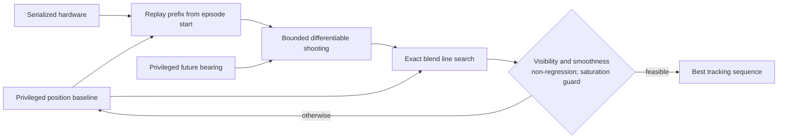

# Privileged Constrained Sequence Oracle V11

## Question

V10 showed that multi-command feedback machinery alone did not give the
recurrent residual a useful learning direction. V11 therefore asks a prior
question: does a materially better, hardware-feasible position-command
sequence exist at all under the frozen visibility and smoothness contract?

The answer on the development block is **yes**. This is an oracle ceiling, not
a deployable controller, and the fresh test remains sealed.

## Protocol

V11 starts from commands produced by the existing privileged position oracle.
For focus segments beginning at control indices 0, 48, and 120, it:

1. replays every command from episode start through the serialized plant;
2. optimizes a bounded 16-command residual using privileged future bearing;
3. retains all pre-focus commands unchanged;
4. evaluates blends from zero to full residual using exact 1 ms integration;
5. independently selects the best blend for each episode only if visibility
   and smoothness do not regress and saturation stays within 5%; and
6. falls back to the unchanged command sequence otherwise.

The plant includes asymmetric travel, body-forward zero, polarity,
quantization, latency, position gain/tolerance, rate lag, rate and acceleration
limits, and control/camera/integration event boundaries. Commands whose latency
has elapsed are pruned from the differentiable queue, preserving exact behavior
while making long prefix replay linear in the active latency depth.



The baseline replay differs from the logged simulator angle by at most
`5.29e-6 rad`, consistent with float32 dataset serialization.

## Development result

The full screen uses 48 disjoint seed/scenario cases, three focus segments,
24 Adam shooting iterations, and exact selection. Negative change is better.

| Metric | Privileged position baseline | V11 oracle | Relative change |
|---|---:|---:|---:|
| Global tracking RMSE | 0.661685 | 0.654783 | **-1.04%** |
| Critical tracking RMSE | 1.029913 | 1.002377 | **-2.67%** |
| Global visibility RMSE | 0.377419 | 0.377361 | **-0.02%** |
| Critical visibility RMSE | 0.341326 | 0.339741 | **-0.46%** |
| Global smoothness RMSE | 0.065576 | 0.058155 | **-11.32%** |
| Critical smoothness RMSE | 0.093508 | 0.052916 | **-43.41%** |
| Global saturation RMSE | 0.714937 | 0.607125 | **-15.08%** |
| Critical saturation RMSE | 1.761634 | 1.360327 | **-22.78%** |

Every frozen check passes. V11 selects a nonzero correction in 41.0% of the
144 episode-windows and the unchanged baseline in 59.0%. Mean selected blend
is 0.244. Corrections are most common at episode start (31/48 cases), then
decline at indices 48 (16/48) and 120 (12/48).

## Interpretation and next gate

V11 resolves the feasibility question that V10 could not answer. Better
tracking does not require sacrificing smoothness, visibility, or saturation;
the previous barrier came from policy optimization and supervision rather than
an empty actuator-level Pareto region.

The next stage is failure-focused distillation. Only the state-conditional
oracle corrections and their causal deployable histories should receive high
weight; zero-correction cases remain an explicit retention set. Distillation
must condition on serialized hardware, regenerate previous student action, and
be evaluated through the plant rather than by command imitation alone. The
oracle result does not authorize fresh-test or sim-to-real claims.

Reproduce with:

```bash
aol-screen-gimbal-sequence-oracle
```

Generated JSON remains under ignored `artifacts/` paths.
